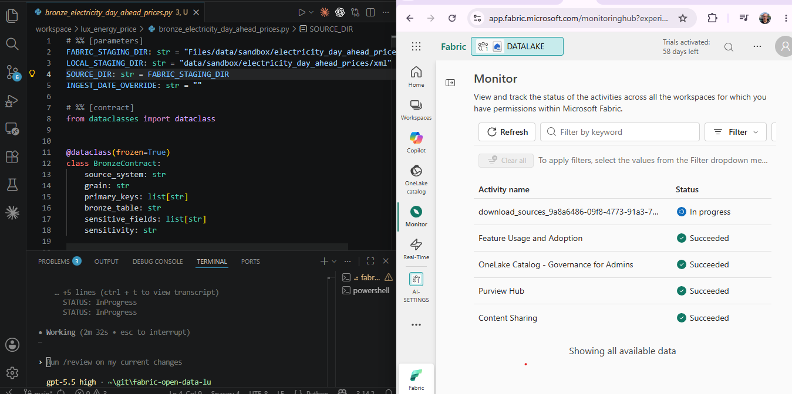
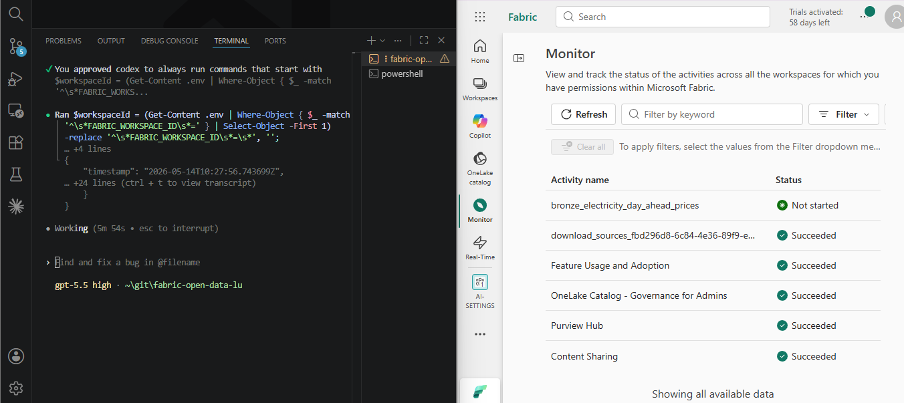
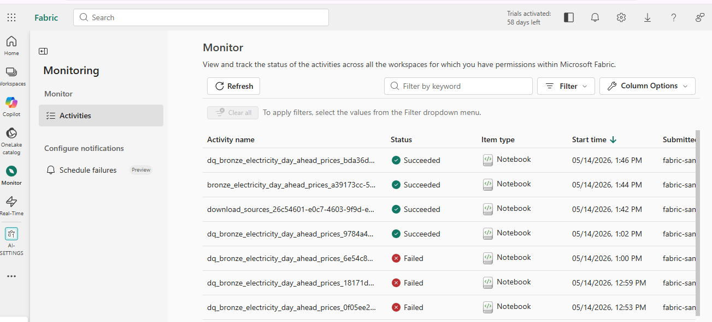
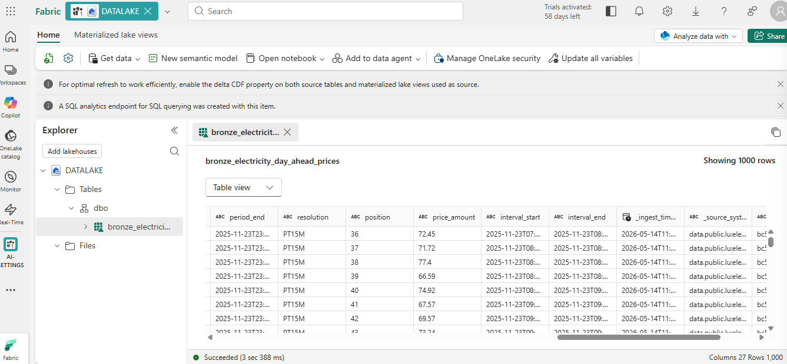

# Fabric Agent Pack

Vendor-native **Codex** and **Claude Code** profiles for Microsoft Fabric data engineering.

Fabric Agent Pack turns a normal git repository into a guided Microsoft Fabric project workspace. It installs agent instructions, specialized skills, setup scripts, validation tools, and notebook deployment helpers so humans can ask for Fabric data engineering work while agents follow a consistent, auditable workflow.

> This repository is the **source package and installer**, not the day-to-day Fabric project workspace. Install a profile into your actual project repository, then run Codex or Claude Code from that target repository root.

## Quick start

### 1. Prepare this source package

From this repository root:

#### Linux / macOS

```bash
./setup.sh                  # check tools and validate package
./setup.sh --install-tools  # also install uv if missing
```

#### Windows (PowerShell)

```powershell
.\setup.ps1                  # check tools and validate package
.\setup.ps1 -InstallTools    # also install uv if missing
.\setup.ps1 -Help            # show usage
```

Both setup scripts check for Git and uv, create `memory/project.md` if absent, and run the package validators.

### 2. Install into a target repository

Use a real project repository as the target. Preview first, then apply:

```bash
# preview changes first
./bin/install-fabric-agent --profile all --target /path/to/project-repo --dry-run

# apply
./bin/install-fabric-agent --profile all --target /path/to/project-repo
```

Then work from the target repository:

```bash
cd /path/to/project-repo
codex   # or: claude
```

### 3. Configure Fabric access in the target repository

Minimum required Fabric workspace role: **Contributor**. Run the setup script — it will prompt for everything interactively. You do not need to edit `.env` manually.

```powershell
# Windows
.\tool\setup\setup.ps1
```
```bash
# Linux / macOS
bash tool/setup/setup.sh
```

The script prompts for four values in order, then authenticates immediately:

| Prompt | Stored where |
|---|---|
| `FABRIC_WORKSPACE_ID` | `.env` |
| `FABRIC_TENANT_ID` | `.env` |
| `FABRIC_CLIENT_ID` | `.env` |
| `FABRIC_CLIENT_SECRET` | OS environment only — never `.env` |

On Windows the secret is written to the user registry via `SetEnvironmentVariable("User")`. On Linux/macOS it is appended to your shell profile (`~/.zprofile`, `~/.bash_profile`, or `~/.profile`).

Create the service principal before running setup:

```text
Azure Portal → App registrations → New registration
  Name: fabric-agent-<project>
  Supported account types: this tenant only

Fabric workspace → Manage access → Add → service principal
  Role: Contributor
```

Re-running setup is idempotent — values already set are skipped.

## Example result

The screenshots below show an end-to-end bronze ingestion of EU day-ahead electricity prices into a Fabric Lakehouse.

**1 — Authoring the bronze notebook**

The developer agent authors `bronze_electricity_day_ahead_prices.py` while the upstream `download_sources` job runs in Fabric.



**2 — Deploying and triggering**

Codex reads the workspace ID from `.env`, deploys the notebook through the Fabric REST API, and triggers the run.



**3 — Full run history**

The Fabric Monitor shows `download_sources` → `bronze_electricity_day_ahead_prices` → `dq_bronze_electricity_day_ahead_prices` succeeding after schema-contract iterations.



**4 — Ingested Delta table**

The resulting Delta table contains 1,000 rows and 27 columns, including lineage envelope fields such as `_ingest_timestamp`, `_source_system`, and `_batch_id`.



## Live reference implementation

[**fabric-open-data-lu**](https://github.com/scardoso-lu/fabric-open-data-lu) is a public target repository with Claude- and Codex-generated scripts for EU open-data ingestion into Microsoft Fabric. It demonstrates the `download_` → `bronze_` → `dq_bronze_` notebook pattern used by this package.

## Learn more

For the deeper human/machine split, architecture diagrams, notebook deployment loop, medallion flow, authoring rules, safety behavior, and validation commands, see [docs/learn-more.md](docs/learn-more.md).

## Validation commands for contributors

Run these from this source package repository after changing profiles, installer logic, guidance, or validation code:

```bash
python3 bin/validate-install-package.py
python3 bin/validate-agent-guidance.py
```

For installer changes, also run a disposable-target smoke test:

```bash
tmp=$(mktemp -d)
git init -q "$tmp"
./bin/install-fabric-agent --profile all --target "$tmp" --dry-run
./bin/install-fabric-agent --profile all --target "$tmp"
./bin/install-fabric-agent --profile all --target "$tmp" --check
```

## What gets installed?

| Profile | Installed into target repo |
|---|---|
| Codex | `AGENTS.md`, `.agents/skills/*/SKILL.md`, `.codex/agents/*.toml`, `.codex/config.toml` |
| Claude | `CLAUDE.md`, `.claude/skills/*/SKILL.md`, `.claude/agents/*.md`, `.claude/settings.json` |
| Shared | `memory/`, placeholder `.env.example`, managed `.gitignore` block, `workspace/`, `data/sandbox/`, `contracts/`, `runbooks/`, `tool/` tooling |

The only shared runtime state between vendor profiles is `memory/`. Runtime Codex assets stay under `profiles/codex/`; runtime Claude assets stay under `profiles/claude/`.


## Why use it?

- **Ship faster** — agents handle notebook authoring, deployment, schema validation, and pipeline wiring. Engineers own approvals and production handoffs.
- **OWASP-compliant by default** — Data Security Top 10 and Supply Chain (A03:2025) baked in: no credential leakage, parameterized queries, pinned dependencies, CVE checks, PII masking.
- **Harness engineering** — agents run inside a structured harness of guardrails, role definitions, skill boundaries, and memory. Consistent, auditable behavior without custom prompt engineering per project.
- **Separation of duties** — implementation, testing, and security review are distinct agents. Nothing reaches production without a human sign-off.
- **Quality gates at every layer** — mandatory Great Expectations checks at bronze, silver, and gold. Failed DQ stops the pipeline; agents do not auto-retry.
- **Token savings** — RTK optimizer cuts shell-output tokens 60–90%, keeping long sessions economical.