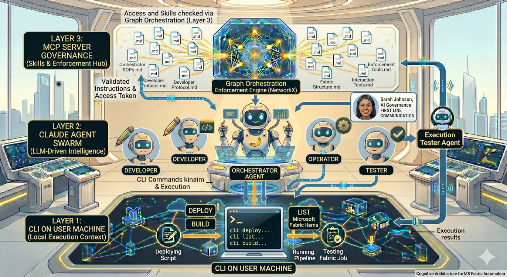

# Fabric Agent Pack

Vendor-native **Codex** and **Claude Code** profiles for Microsoft Fabric data engineering.

Fabric Agent Pack turns a normal git repository into a guided Microsoft Fabric project workspace. It installs agent instructions, specialized skills, setup scripts, validation tools, and notebook deployment helpers so humans can ask for Fabric data engineering work while agents follow a consistent, auditable workflow.

> This repository is the **source package and installer**, not the day-to-day Fabric project workspace. Install a profile into your actual project repository, then run Codex or Claude Code from that target repository root.

**Overview**



## Quick start

The CLI is published as `fabric-skills-settings` on PyPI. Installing it puts two console scripts on your PATH:

| Command | Role |
|---|---|
| `fabric-agents` | Install / check / refresh agent profiles in a project repo |
| `fabric-cli` | Daily Fabric helpers run from a project repo (notebook, pipeline, lakehouse, workspace, lint, precommit) |

### Step 1 — Install the CLI

```bash
uv tool install fabric-skills-settings        # recommended
# or
pip install fabric-skills-settings
```


### Step 2 — Install a profile into your project repo

```bash
# preview
fabric-agents install --profile claude --target /path/to/project-repo --dry-run

# apply (also runs the target bootstrap: ms-fabric-cli + creds + workspaces.json)
fabric-agents install --profile claude --target /path/to/project-repo

# verify drift later
fabric-agents check --profile claude --target /path/to/project-repo
```

`fabric-agents install` copies the profile, scaffold, and tool files into the target, then runs the target's bootstrap script (`<target>/tool/setup/setup.{ps1,sh}`) to install `ms-fabric-cli`, prompt for `FABRIC_TENANT_ID` / `CLIENT_ID` / `CLIENT_SECRET`, verify auth, and populate `workspaces.json`. Pass `--no-bootstrap` to skip.

### Step 3 — Daily work inside the project

Once a profile is installed, run the daily helpers via `fabric-cli` from the project root:

```bash
fabric-cli notebook build  <name>
fabric-cli notebook deploy <name> <workspace_id>
fabric-cli pipeline manage list
fabric-cli lakehouse list-tables
fabric-cli workspace switch <displayName>
fabric-cli lint
fabric-cli precommit
```

Each subcommand passes its trailing argv through to the underlying `tool/<group>/<script>` in the target repo, so existing flags work unchanged. Use `fabric-cli <group> --help` to see what each script accepts.

### `fabric-agents` flags

| Flag | Effect |
|---|---|
| `--profile {codex,claude,all}` / `-p` | Pick the agent profile (required) |
| `--target <path>` / `-t` | Target git repository (required) |
| `--dry-run` | Preview changes without writing (install/refresh only) |
| `--force` | Overwrite non-managed existing files |
| `--backup` | Back up replaced files alongside the originals |
| `--no-bootstrap` | Copy files only; skip the post-install Fabric auth + workspaces.json bootstrap (install only) |
| `--verbose` / `-v` | Debug-level logging |
| `--quiet` / `-q` | Suppress info logging |
| `--help` / `-h` | Show usage |

### Service-principal credentials

Minimum Fabric workspace role: **Contributor**. The bootstrap prompts for these and stores them safely:

| Prompt | Stored where |
|---|---|
| `FABRIC_TENANT_ID` | `<target>/.env` |
| `FABRIC_CLIENT_ID` | `<target>/.env` |
| `FABRIC_CLIENT_SECRET` | OS environment only — never `.env` |

On Windows the secret is written to the user registry via `SetEnvironmentVariable("User")`. On Linux/macOS it is appended to your shell profile (`~/.zprofile`, `~/.bash_profile`, or `~/.profile`).

Create the service principal once, before running setup:

```text
Azure Portal → App registrations → New registration
  Name: fabric-agent-<project>
  Supported account types: this tenant only

Fabric workspace → Manage access → Add → service principal
  Role: Contributor
```

Re-running the same install command is idempotent — credentials already set are skipped, and managed files only change when their source content changes. If you need to bootstrap again later (e.g. after rotating the secret), run `<target>/tool/setup/setup.{ps1,sh}` directly from inside the target.


## Learn more

- [docs/workflow.md](docs/workflow.md) — agent → skill → tool → Fabric flow, focused on what you get in the target repo.
- [docs/knowledge-graph.md](docs/knowledge-graph.md) — what's indexed under `memory/` and the `graph_*` MCP surface the agents call.
- [docs/architecture.md](docs/architecture.md) — full source-vs-target picture: MCP servers, folder layout, setup CLI, and the redesign migration notes.


## Example result

The screenshots below show an end-to-end bronze ingestion of EU day-ahead electricity prices into a Fabric Lakehouse.

**1 — Authoring the bronze notebook**

The developer agent authors `bronze_electricity_day_ahead_prices.py` while the upstream `download_sources` job runs in Fabric.


**2 — Deploying and triggering**

Codex reads the workspace ID from `.env`, deploys the notebook through the Fabric REST API, and triggers the run.


**3 — Full run history**

The Fabric Monitor shows `download_sources` → `bronze_electricity_day_ahead_prices` → `dq_bronze_electricity_day_ahead_prices` succeeding after schema-contract iterations.


**4 — Ingested Delta table**

The resulting Delta table contains 1,000 rows and 27 columns, including lineage envelope fields such as `_ingest_timestamp`, `_source_system`, and `_batch_id`.


**5 — Restricted workspace for AI agentic development**

The agent runs in a dedicated workspace. Permissions are set at the workspace level to ensure there is no access to production data or pipelines.


**6 — Development Lifecycle**

The code is integrated with Git, and the agent develops everything in a dedicated feature branch. Human developers can review the pull request later and merge the work from the feature branch into dev.


> **Note**: The VIBECODING workspace was set up by selecting individual Fabric items. This narrowed down the codebase to only the scripts that stakeholders actually care about.

## Live reference implementation

[**fabric-open-data-lu**](https://github.com/scardoso-lu/fabric-open-data-lu) is a public target repository with Claude- and Codex-generated scripts for EU open-data ingestion into Microsoft Fabric. It demonstrates the `download_` → `bronze_` → `dq_bronze_` notebook pattern used by this package.

## Why use it?

- **Ship faster** — agents handle notebook authoring, deployment, schema validation, and pipeline wiring. Engineers own approvals and production handoffs.
- **OWASP-compliant by default** — Data Security Top 10 and Supply Chain (A03:2025) baked in: no credential leakage, parameterized queries, pinned dependencies, CVE checks, PII masking.
- **Harness engineering** — agents run inside a structured harness of guardrails, role definitions, skill boundaries, and memory. Consistent, auditable behavior without custom prompt engineering per project.
- **Separation of duties** — implementation, testing, and security review are distinct agents. Nothing reaches production without a human sign-off.
- **Quality gates at every layer** — mandatory Great Expectations checks at bronze, silver, and gold. Failed DQ stops the pipeline; agents do not auto-retry.
- **Token savings** — RTK optimizer cuts shell-output tokens 60–90%, keeping long sessions economical.
