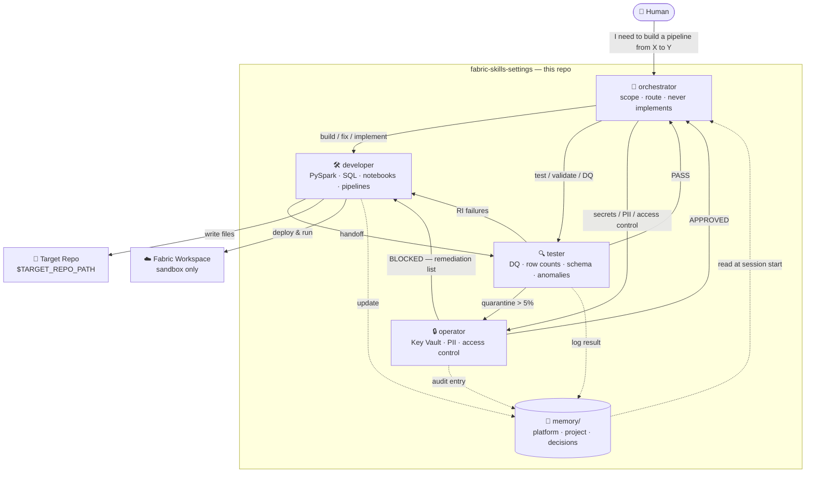
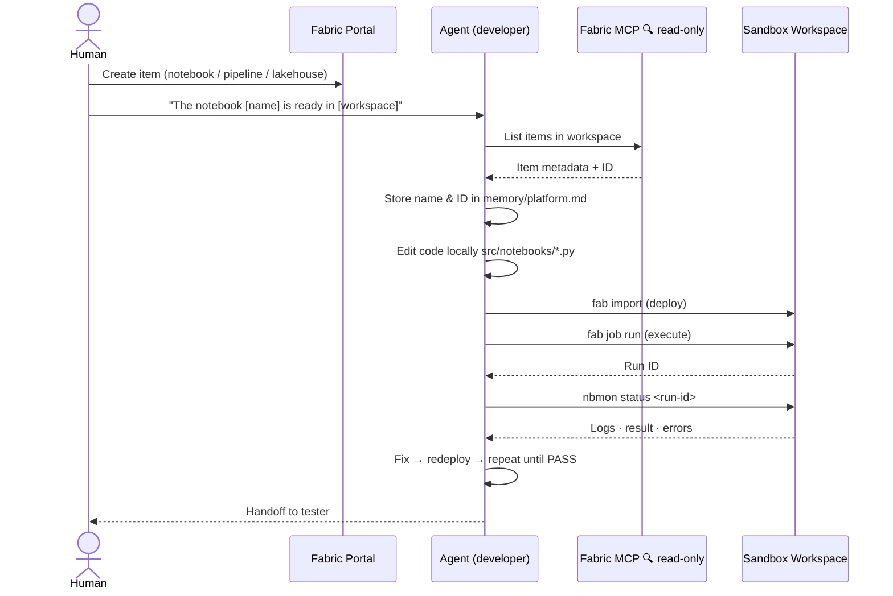
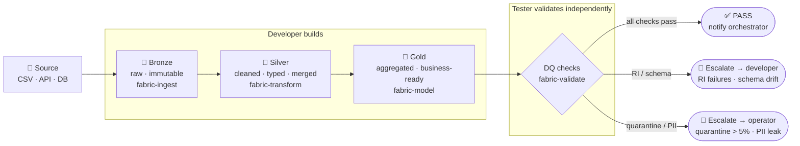

# Fabric Codex

Agent-powered operating system for Microsoft Fabric data engineering.

## How it works



---

## Fabric item lifecycle



---

## Medallion pipeline flow



---

## Quick Start

```bash
git clone <this-repo>
cd fabric-skills-settings
./setup.sh --install-tools        # install uv, Fabric CLI, nbmon
fab auth login                     # authenticate once
./setup.sh --checklist             # verify everything is ready
```

Then open Claude Code or Codex and type:
> "I need to build a pipeline from [source] to [target]"

---

## Installation

1. [ ] Clone this repo and run `./setup.sh --install-tools`.
2. [ ] Create a sandbox Fabric workspace at <https://app.fabric.microsoft.com>.
3. [ ] Create three lakehouses: `bronze_lh`, `silver_lh`, `gold_lh`.
4. [ ] Copy workspace and lakehouse IDs into `.env`.
5. [ ] Set `TARGET_REPO_PATH=/path/to/your/project` in `.env`.
6. [ ] Run `fab auth login`, then `./setup.sh --checklist` to confirm everything is green.

---

## Agents

| Agent | Role |
|---|---|
| **orchestrator** | Scopes tasks, routes to specialists — never implements |
| **developer** | PySpark, SQL, notebooks, pipeline assets, sandbox execution |
| **tester** | Independent validation, DQ checks, anomaly detection |
| **operator** | Key Vault, access control, PII review, security handoff |

**Standard flow**: orchestrator → developer → tester
**Add operator** for any task touching secrets, PII, or access control.

---

## Skills

| Skill | Purpose |
|---|---|
| `fabric-ingest` | Any source → Lakehouse / Warehouse ingestion |
| `fabric-transform` | Cleaning, typing, deduplication, MERGE |
| `fabric-model` | Dimensions, facts, KPIs, semantic models |
| `fabric-validate` | DQ checks, schema drift, row counts, anomalies |
| `fabric-notebook-loop` | Local `.py` → deploy → run → nbmon → fix cycle |
| `fabric-ops` | Orchestration, VACUUM, platform inventory |

Install optional external packs:
```bash
./bin/install-skills.sh add microsoft/skills-for-fabric
./bin/install-skills.sh list
```

---

## Project Structure

```
fabric-skills-settings/
├── CLAUDE.md              # Claude Code entry point
├── AGENTS.md              # Codex CLI entry point
├── setup.sh               # Bootstrap script
├── .env.example           # Config template
│
├── .claude/agents/        # orchestrator · developer · tester · operator
├── rules/                 # security · data-engineering · fabric-platform
├── skills/                # fabric-ingest · transform · model · validate · loop · ops
├── templates/             # source-contract · runbook · pipeline-brief · mock-data …
├── docs/                  # context · smoke-test · MCP discovery · guidance map
├── config/                # thresholds.yaml
├── bin/                   # setup helpers · validators · fab-sandbox · nbmon-sandbox
└── memory/                # local per-clone — gitignored
    ├── MEMORY.md          # index — read every session
    ├── platform.md        # Fabric items · target repo · source systems
    ├── project.md         # active pipelines · known issues
    ├── decisions.md       # architecture decisions
    ├── runbooks/
    └── security/
```

---

## Rules (always enforced)

- **security.md** — no hardcoded secrets, Key Vault refs, audit envelope, sandbox boundary
- **data-engineering.md** — idempotency, lineage, quality gates, schema evolution
- **fabric-platform.md** — async API pattern, Spark/SQL, nbmon debugging

---

## Requirements

| Tool | Install |
|---|---|
| Python 3.10+ | python.org |
| uv | `curl -LsSf https://astral.sh/uv/install.sh \| sh` |
| Fabric CLI | `uv tool install ms-fabric-cli` |
| nbmon | `uv tool install nbmon` |

---

## License

MIT
