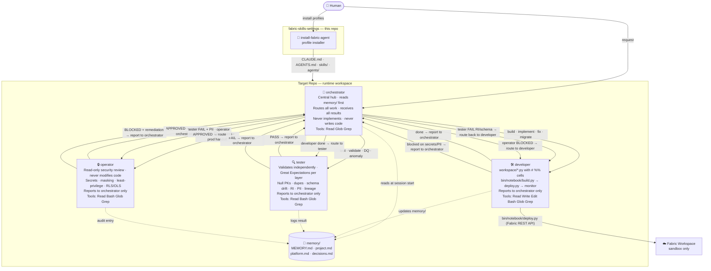
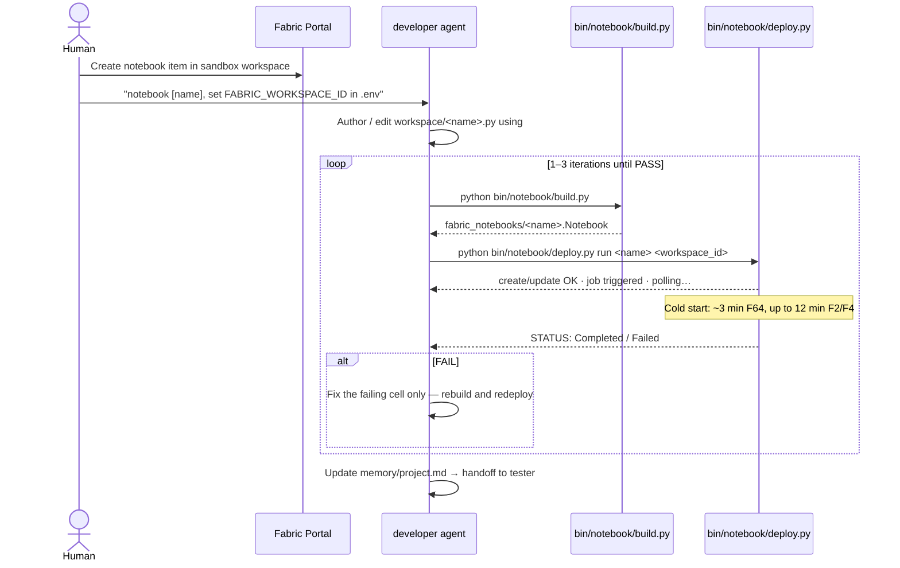
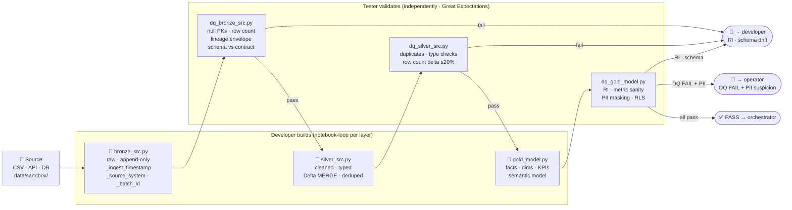

# Fabric Agent Pack

Vendor-native Codex and Claude Code profiles for Microsoft Fabric data engineering.

This repository is an installer/source package. It should not be used as the day-to-day Fabric project workspace. Install one or both profiles into the actual project repository, then open Codex or Claude Code from that target repository root.

## How it works



## Setup this source package

### Linux / macOS

```bash
./setup.sh                  # check tools and validate package
./setup.sh --install-tools  # also install uv if missing
```

### Windows (PowerShell)

```powershell
.\setup.ps1                  # check tools and validate package
.\setup.ps1 -InstallTools    # also install uv if missing
.\setup.ps1 -Help            # show usage
```

Both scripts check for Git and uv, create `memory/project.md` if absent, and run the package validators.

## Profiles

| Profile | Installs |
|---|---|
| Codex | `AGENTS.md`, `.agents/skills/*/SKILL.md`, `.codex/agents/*.toml`, `.codex/config.toml` |
| Claude | `CLAUDE.md`, `.claude/skills/*/SKILL.md`, `.claude/agents/*.md`, `.claude/settings.json` |
| Shared | `memory/`, placeholder `.env.example`, `.gitignore` block, `workspace/`, `data/sandbox/`, `contracts/`, `runbooks/`, selected `bin/` tooling |

Profiles own their own instructions, skills, agents, and settings. The only shared runtime state is `memory/`.

## Install into a target repository

```bash
# preview changes first
./bin/install-fabric-agent --profile all --target /path/to/project-repo --dry-run

# apply
./bin/install-fabric-agent --profile all --target /path/to/project-repo
```

Then work from the target repository:

```bash
cd /path/to/project-repo
codex   # or: claude
```

## Notebook deploy loop

The developer never uses the Fabric portal to edit notebooks. All changes happen in local `.py` files and are deployed via the Fabric REST API.



> `fab import` and `fab job run` require an interactive Windows console and fail in Git Bash or sandboxed environments. `bin/notebook/deploy.py` uses `fab api` (REST API calls via CLI) which works everywhere.

## Medallion pipeline flow

DQ notebooks are always separate files from ingestion notebooks. The tester validates each layer independently using Great Expectations.



## Safety behavior

`bin/install-fabric-agent` requires a git target, refuses to install into this source repo unless `--self-test` is passed, protects unmanaged files by default, supports `--backup`, and merges a managed `.gitignore` block idempotently.

## Validation

Run these from this source package repository. They validate the installer package and profile guidance; they are not installed into target repositories.

```bash
uv run bin/validate-install-package.py
uv run bin/validate-agent-guidance.py
```

To check that an installed target repository is still aligned with this package, run the installer check from this source repository:

```bash
uv run python bin/install-fabric-agent --profile all --target /path/to/project-repo --check
```

For installer changes, also run a disposable-target smoke test:

```bash
tmp=$(mktemp -d)
git init -q "$tmp"
./bin/install-fabric-agent --profile all --target "$tmp" --dry-run
./bin/install-fabric-agent --profile all --target "$tmp"
./bin/install-fabric-agent --profile all --target "$tmp" --check
```
