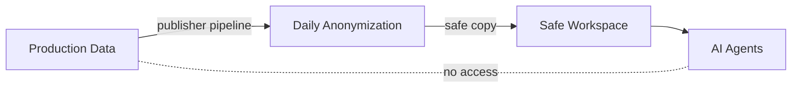
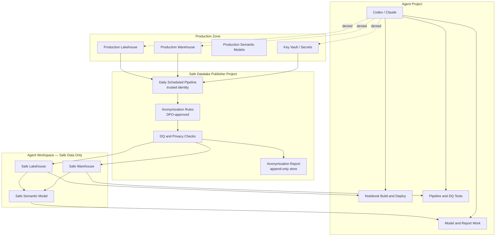
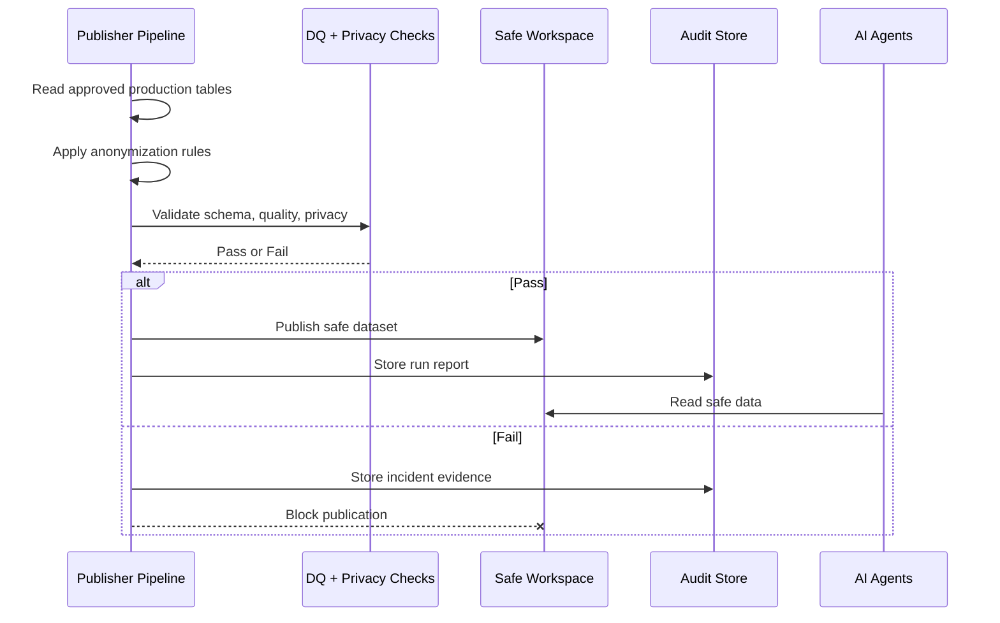

# Data Privacy Operating Model

**Last updated:** 2026-05-17

Personal data never reaches the AI tools. A separate trusted process anonymizes it first and publishes a safe copy. The AI works only on that safe copy.

---

## How It Works

The AI tools never touch raw or personal data. If the anonymization check fails, nothing is published and the AI continues working on the previous safe copy until the issue is resolved.

---

## What Can and Cannot Happen

| | Allowed | Blocked |
|---|---|---|
| **AI agents** | Read anonymized and synthetic data · Build notebooks, pipelines, and models · Run data quality checks | Read personal data · Access production systems · Approve their own access |
| **Anonymization pipeline** | Read approved production sources · Apply DPO-approved rules · Publish safe datasets · Write anonymization reports | Write raw data to the agent workspace · Skip quality or privacy checks |
| **Sandbox workspace** | Anonymized tables · Synthetic tables · Aggregated data · Safe semantic models | Raw personal records · Direct shortcuts to production · Production credentials |

---

## Who Is Responsible for What

| Area | Owner | Key point |
|---|---|---|
| Reading production data | Safe datalake publisher project | Trusted identity only. No agent access. |
| Anonymization rules and pipeline | Safe datalake publisher project | DPO-approved, scheduled, audited daily. |
| Anonymization evidence and reports | Safe datalake publisher project | Stored outside the agent workspace. |
| Synthetic data for development | Agent tool pack | Mock generator for dev and test schemas — no real data needed. |
| AI notebook and model development | Agent project | Works on safe data only. |
| Access enforcement | Fabric platform (OneLake IAM) | Hard boundary — not a policy document. |

---

## Compliance Snapshot

**Ready to go when all of these are true:**

- The anonymization pipeline runs daily under a trusted non-agent identity.
- The agent workspace contains only anonymized, synthetic, or approved aggregated data.
- No shortcut in the agent workspace points to production.
- The agent runtime holds no production credentials or workspace IDs.
- Every pipeline run produces an anonymization, DQ, and privacy report.
- Failed privacy checks block publication automatically.
- Fabric audit logs are enabled and exportable.
- The DPO has approved the anonymization policy.
- A DPIA and AI governance record exist where required.

**Stop if any of these are true:**

- An agent identity can access production workspaces, lakehouses, warehouses, or Key Vault.
- The publisher writes raw data into the agent workspace.
- The agent workspace contains production shortcuts.
- Publisher runs lack privacy or quality checks.
- Audit evidence cannot tie safe data back to a specific publisher run.

---

---

## For Architects and Engineers

The sections below cover implementation detail, controls, and compliance evidence.

### Architecture

### Daily Publication Flow

### Implementation Steps

#### 1 — Lock Production Away From Agents

Agent service principals must have zero production permissions. Verify:

- Cannot list or access production workspaces, lakehouses, warehouses, or semantic models.
- Cannot read production OneLake paths or Key Vault secrets.
- Cannot run production notebooks or pipelines.
- Cannot grant themselves access.

#### 2 — Build the Publisher Pipeline

Only the publisher project reads production sources. Required controls:

- Dedicated service principal with minimum necessary production read scope.
- Daily schedule with alerting on failure.
- Explicit source allowlist — no wildcard table reads.
- DPO-approved anonymization rules per table.
- Separate Key Vault instance from the agent workspace.
- Failed privacy checks block publication — no partial writes.

#### 3 — Control What Enters the Safe Workspace

The agent workspace must be kept clean.

Allowed: anonymized tables, synthetic tables, aggregated data meeting re-identification thresholds, safe semantic models and notebooks.

Not allowed: raw personal records, OneLake shortcuts to production, production workspace IDs embedded in notebooks or pipeline parameters, production credentials, models that connect back to production, export to unapproved external destinations.

#### 4 — Agent Tooling Posture

- Keep `tool/data/mock-data-generator.py` for dev and test schemas.
- Production anonymization lives in the publisher project — not here.
- Remove `Bash(fab *)`, `Bash(rtk *)`, and broad MCP API tools from profile allowlists.
- Profile guidance must not reference production workspace IDs or credentials.

#### 5 — Publisher Evidence (Per Run)

Store outside the agent workspace in append-only or access-controlled storage:

- Run ID and timestamp
- Source dataset list and target safe dataset list
- Anonymization policy version
- Anonymization, DQ, and privacy threshold reports
- Publishing identity (service principal)
- Pass/fail status and incident reference on failure

#### 6 — Boundary Penetration Test

Test using the actual agent identity. Confirm the agent cannot reach production via:

- Direct Fabric CLI (`fab`)
- MCP tools
- Notebook deploy and run
- Pipeline run
- Semantic model inspection
- Lakehouse table listing
- OneLake shortcut creation
- Environment variable override attempts
- Production workspace ID injection

Pass: agent reaches only safe workspace assets and is denied everywhere else, including when bypassing local helper tools.

#### 7 — Notebook Deployment Policy

Check before every deploy or run:

- Target workspace ID matches the safe workspace.
- No production OneLake paths or shortcuts in notebook code.
- No secret-printing, token-logging, or credential-exfiltration patterns.
- No unmanaged external AI or model API calls.
- No export to unapproved destinations.

#### 8 — Centralized Audit

Fabric audit logs plus publisher run logs are the compliance source of truth. Capture per event:

- Agent identity, publisher identity, workspace ID
- Dataset accessed, notebook/pipeline executed
- Anonymization report reference
- Timestamp and result

Local repo logs may help debugging but are not sufficient for GDPR or EU AI Act evidence.

### Control Matrix

| Risk | Primary control | Supporting control | Status |
|---|---|---|---|
| Agent reads production data | Fabric IAM / OneLake security | Profile allowlist tightening | Mitigated when production access is denied at platform level |
| Agent bypasses wrappers with `fab` | Fabric denies production scope | Allowlist removes `fab *` | Impact reduced; allowlist tightening still required |
| Notebook reads raw data | Workspace-scoped permissions | Notebook policy check pre-deploy | Mitigated when no production paths or shortcuts exist |
| Unsafe anonymization published | Publisher DQ and privacy checks | Anonymization report audit | Controlled by publisher project |
| Audit gaps | Fabric audit + publisher evidence | MCP/helper logs | Requires centralized evidence store |
| Production secret leakage | Separate identities and Key Vault | Env integrity checks | Must be enforced per deployment |
| EU AI Act traceability | AI governance file | Agent run logs | Required — document intended and prohibited use |

### GDPR Evidence Checklist

- [ ] DPIA for production-to-safe-datalake processing
- [ ] Records of Processing Activities
- [ ] Lawful basis assessment
- [ ] Data minimisation policy
- [ ] Anonymization policy (DPO-approved)
- [ ] Retention policy
- [ ] Data subject rights process
- [ ] Incident response procedure
- [ ] Processor and subprocessor register
- [ ] DPO sign-off

### EU AI Act Evidence Checklist

- [ ] Intended-use statement
- [ ] Prohibited-use statement
- [ ] Model and provider register
- [ ] Risk classification
- [ ] Human oversight procedure
- [ ] Logging and monitoring design
- [ ] Validation plan
- [ ] Change-control process
- [ ] Incident escalation process
