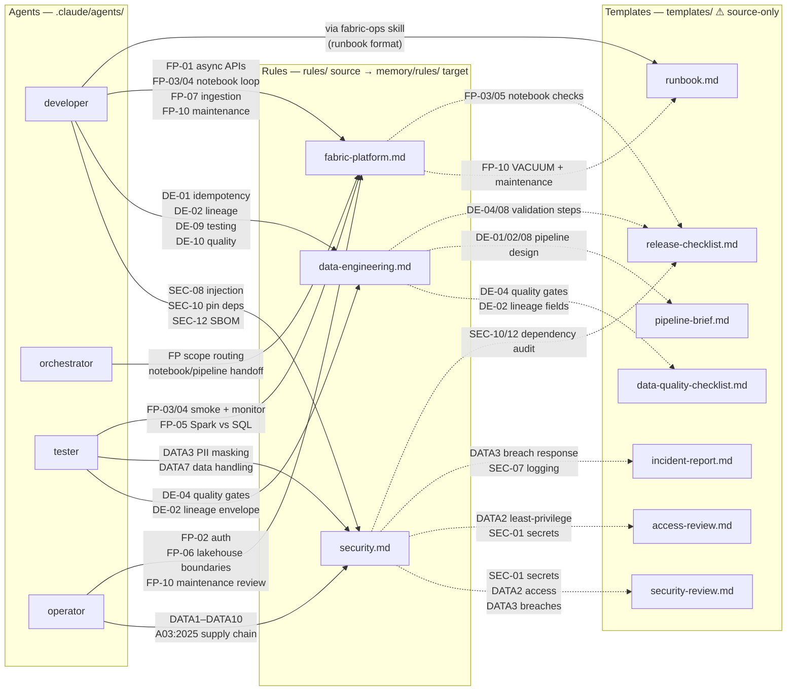

# Agent Map

Shows which **agents** are bound to which **rules** and **templates**, and which **rules** each **template** formalises.

> **Scope**: source-package relationships. Rules live under `rules/` in this package and are installed into target repos as `memory/rules/`, then loaded through `memory/MEMORY.md`. Templates remain source-only human-facing artefacts referenced by format, not by file-read at runtime.

**Solid arrows** = explicit reference found in source files.  
**Dashed arrows** = inferred from content coverage (template checks implement the named rules; no direct cross-file link exists).

## Agent skill registry

| Agent | Skills available | Rules embedded inline |
|---|---|---|
| `developer` | fabric-ingest, fabric-transform, fabric-model, fabric-notebook-loop, fabric-ops, fabric-pipeline, git-commit, mock-data, semantic-model | SEC-08, SEC-10, SEC-12, DE-01, DE-02, DE-09, DE-10, FP-01, FP-03, FP-04, FP-07, FP-10 |
| `tester` | fabric-validate, fabric-ops, semantic-model | DE-04, DE-02, DATA3, DATA7, FP-03, FP-04, FP-05 |
| `operator` | *(none — review only, no writes)* | DATA1–DATA10, A03:2025, FP-02, FP-06, FP-10 |
| `orchestrator` | prd, grill-me | FP routing and handoff boundaries |

`fabric-transform` and `fabric-model` are developer-owned authoring skills. `fabric-validate` is the tester-owned validation skill. Their direct rule anchors are DE-06, FP-08, and DE-04 respectively.

## Template coverage by rule domain

| Template | Primary rule domain | Rule codes |
|---|---|---|
| `runbook.md` | fabric-platform.md | FP-10 VACUUM, FP-08 Gold optimisation, FP-04 debug |
| `security-review.md` | security.md | SEC-01, DATA2, DATA3, DATA7 |
| `data-quality-checklist.md` | data-engineering.md + security.md | DE-04, DE-02, DATA3, DATA7, DATA9 |
| `access-review.md` | security.md | DATA2, SEC-01, SEC-11 |
| `incident-report.md` | security.md | DATA3, SEC-07, DATA7 |
| `pipeline-brief.md` | data-engineering.md | DE-01, DE-02, DE-08 |
| `release-checklist.md` | data-engineering.md + fabric-platform.md + security.md | DE-04, DE-08, FP-03, SEC-10, SEC-12 |
