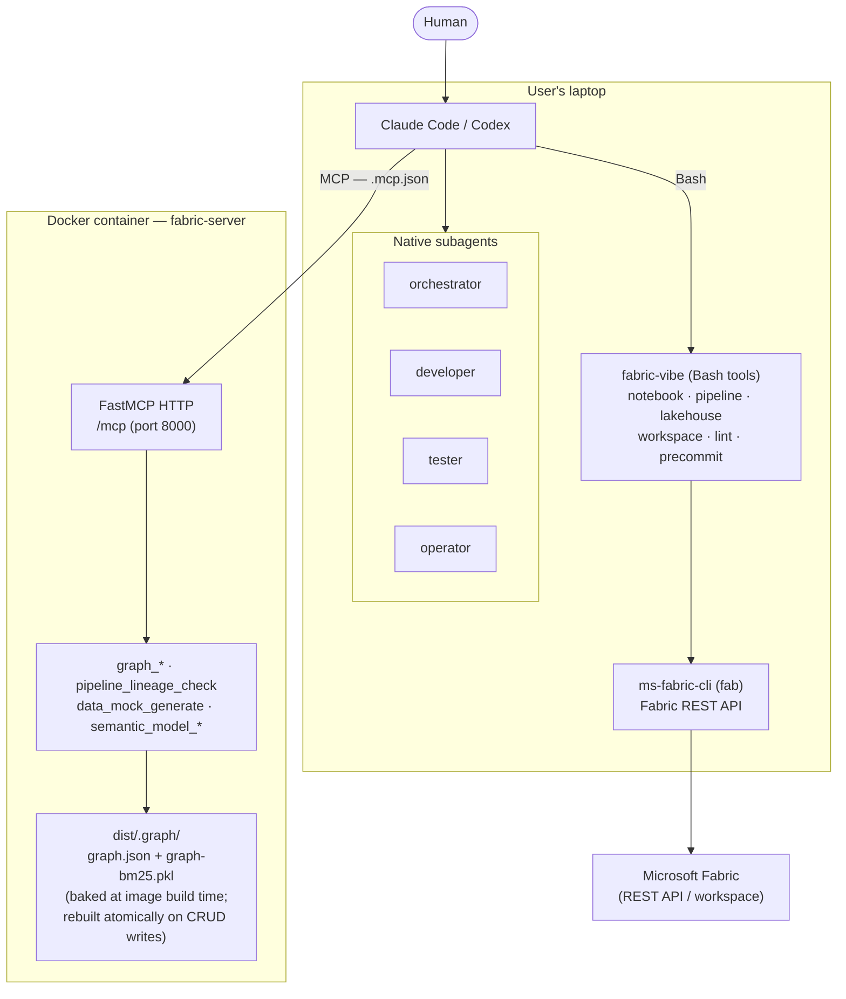
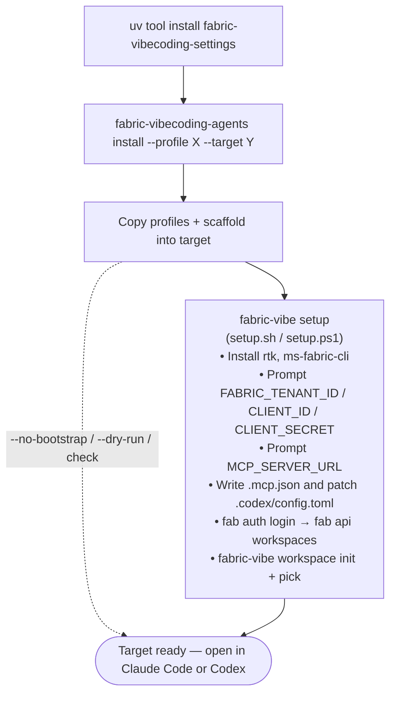

# Architecture

Fabric Agent Pack installs agent profiles (Claude Code and Codex) into a target repository and provides a shared FastMCP knowledge-graph server. There is **one** MCP server: `fabric-server`, running in Docker. Fabric CLI–dependent helpers (`fab`, notebook, pipeline, workspace) are plain Python scripts invoked via Bash from the user's laptop through the `fabric-vibe` proxy CLI.

## Components

| Component | What it is | Where it runs |
|---|---|---|
| `fabric-vibecoding-agents` | Typer CLI — `install` / `check` / `refresh` profiles into a target repo | User's laptop |
| `fabric-vibe` | Typer proxy — dispatches `notebook`, `pipeline`, `lakehouse`, `workspace`, `lint`, `precommit`, `setup` to packaged helpers | User's laptop |
| `fabric-server` | FastMCP HTTP server — graph, validate, data, semantic-model tools | Docker container (port 8000) |
| Agents (4) | `orchestrator`, `developer`, `tester`, `operator` — native subagents installed under `.claude/agents/` and `.codex/agents/` | Claude Code / Codex |
| `.mcp.json` | Points Claude/Codex at `<MCP_SERVER_URL>/mcp` — written by `setup.sh` / `setup.ps1` at bootstrap time | Target repo root |

## High-level flow



## CLI — install path

The package is published as `fabric-vibecoding-settings` and exposes two console scripts:

| Command | Role |
|---|---|
| `fabric-vibecoding-agents` | `install` / `check` / `refresh` agent profiles and scaffold into a target repo |
| `fabric-vibe` | Target-side proxy for package-owned helpers |

```bash
uv tool install fabric-vibecoding-settings
fabric-vibecoding-agents install --profile claude --target /path/to/project
fabric-vibecoding-agents check   --profile claude --target /path/to/project
fabric-vibecoding-agents refresh --profile claude --target /path/to/project
```

`--target` is required. After copying files, `install` automatically invokes `fabric-vibe setup` (i.e. `setup.sh` / `setup.ps1`) unless `--no-bootstrap` is given.



## Agents (installed into target)

| Subagent | Owns |
|---|---|
| `orchestrator` | Scope, route, human handoff |
| `developer` | Notebooks, transforms, models, pipelines |
| `tester` | DQ, schema drift, RI, metric sanity |
| `operator` | Security review, secrets, access |

Claude agents live in `.claude/agents/*.md`; Codex agents in `.codex/agents/*.toml`.

## MCP server tools

`fabric-server` (`server/app.py`) registers four tool groups:

| Group | Tools |
|---|---|
| Graph | `graph_get_entry`, `graph_get_node`, `graph_get_linked`, `graph_search`, `graph_list_kinds`, `graph_create_node`, `graph_update_node`, `graph_delete_node`, `graph_add_edge`, `graph_remove_edge` |
| Validate | `pipeline_lineage_check` |
| Data | `data_mock_generate` |
| Semantic model | `semantic_model_list`, `semantic_model_show` |

The server has **no filesystem access** to the user's project. `pipeline_lineage_check` accepts uploaded file contents; `data_mock_generate` requires a `target_dir` mounted into the container.

## Bash tools (fabric-vibe, invoked via Bash not MCP)

| Command | What it drives |
|---|---|
| `fabric-vibe notebook build` | `cli/tools/notebook/build.py` |
| `fabric-vibe notebook deploy` | `cli/tools/notebook/deploy.py` |
| `fabric-vibe notebook smoke-test` | `cli/tools/notebook/smoke-test.{sh,ps1}` |
| `fabric-vibe pipeline manage` | `cli/tools/pipeline/manage.py` |
| `fabric-vibe lakehouse list-tables` | `cli/tools/lakehouse/list-tables.py` |
| `fabric-vibe workspace init/switch/transfer/pick` | `cli/tools/workspace/*.py` |
| `fabric-vibe lint` | `cli/tools/lint/__main__.py` |
| `fabric-vibe precommit` | `cli/tools/precommit/pre-commit-check.{sh,ps1}` |
| `fabric-vibe setup` | `cli/setup/setup.{sh,ps1}` |

## Source layout

```text
fabric-vibecoding-settings/
├── cli/
│   ├── src/fabric_skills_settings/   pip wheel (fabric-vibecoding-settings)
│   │   ├── cli.py                    fabric-vibecoding-agents Typer CLI
│   │   ├── runtime_cli.py            fabric-vibe Typer proxy
│   │   ├── commands/{install,check,refresh}.py
│   │   └── core/{files,gitignore,profiles,bootstrap,markers,paths,version_check}.py
│   ├── profiles/
│   │   ├── claude/                   CLAUDE.md, agents/*.md, settings.local.json
│   │   ├── codex/                    AGENTS.md, agents/*.toml, config.toml
│   │   └── shared/                   .env.example, .gitignore.fragment, scaffold/
│   ├── setup/                        setup.sh, setup.ps1
│   └── tools/                        notebook/, pipeline/, lakehouse/, workspace/, lint/, precommit/
│
├── server/
│   ├── app.py                        FastMCP app — registers all tool groups
│   ├── __main__.py                   uvicorn entrypoint (python -m server)
│   ├── audit.py                      structured JSON audit log
│   ├── tools/{graph,validate,data,semantic_model}/
│   ├── graph/{store,search,builder,writes,extract,schema,lock}.py
│   ├── content/                      knowledge-graph source markdown
│   ├── skills/                       skill SKILL.md files
│   ├── builders/                     build-graph.py (build-time only)
│   ├── Dockerfile
│   └── docker-compose.yml
│
├── tests/                            pytest suite + _validation/ helpers
└── docs/
```

## Installed target layout (what install produces)

```text
<target-repo>/
├── CLAUDE.md   (claude profile) / AGENTS.md   (codex profile)
├── .env.example  .gitignore
├── .mcp.json                         written by setup — concrete MCP URL
├── .claude/agents/*.md               claude subagents
├── .claude/settings.local.json
├── .codex/agents/*.toml              codex subagents
├── .codex/config.toml                codex MCP config (url updated by setup)
├── data/sandbox/
└── workspace/
```
