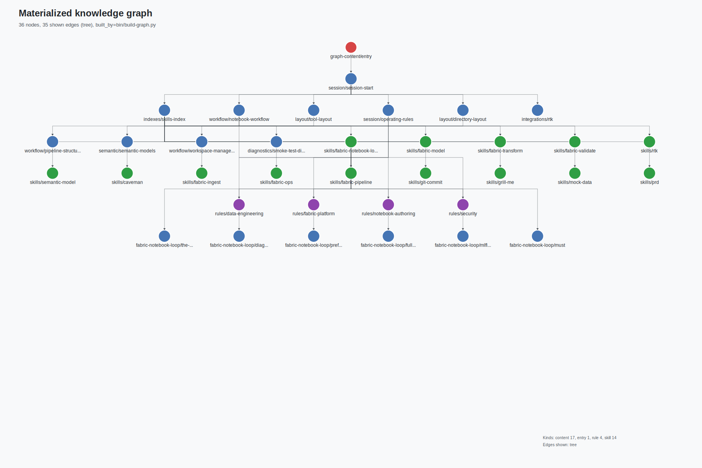
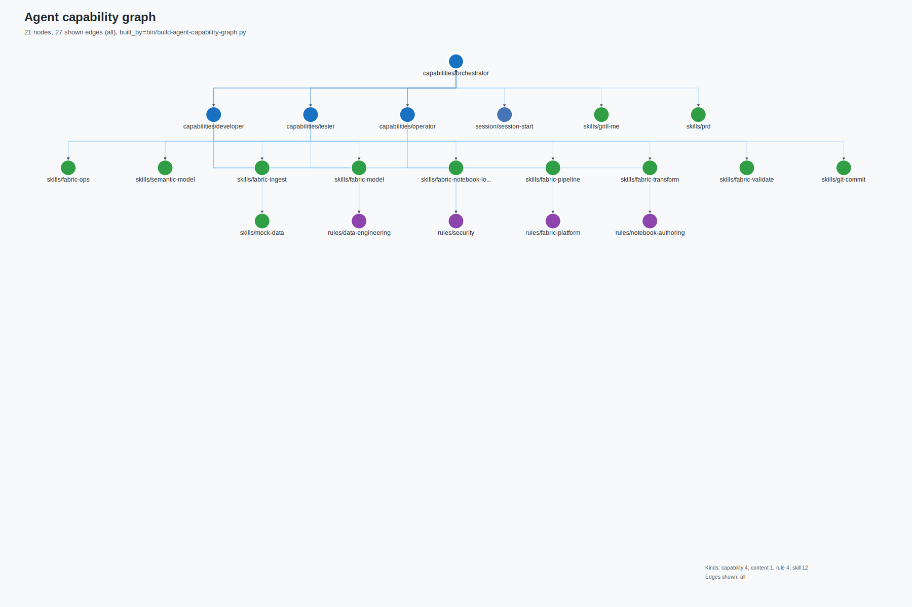

# Architecture

Fabric Agent Pack installs two MCP servers into every target repository. Together they give Claude Code and Codex a structured way to discover project knowledge and act against a Microsoft Fabric workspace.

| Server | Role | Module |
|---|---|---|
| `fabric` | Wraps the Fabric CLI: list/get items, authenticated REST API calls. | `tool/mcp/server.py` |
| `fabric-graph` | RAG knowledge graph: BM25 + 1-hop edge-aware read tools and full CRUD over nodes and edges. | `tool/mcp/graph-server.py` |

The installed `CLAUDE.md` / `AGENTS.md` entrypoints are minimal (~30 lines). They tell the agent to call `graph_get_entry` first and then traverse the graph; all operational knowledge — setup gate, session-start order, workflow steps, skills, tools, rules — is encoded as graph nodes, not as static markdown for the agent to read directly.

## Diagram 1 — `fabric-graph`: the RAG flow

How knowledge enters the graph, gets indexed, and is served to the agent.

**Key properties:**

- **Single source of truth**: all knowledge lives in markdown files under known paths. The graph is a derived artifact, never edited by hand.
- **BM25 + edges**: `graph_search` returns BM25 hits and re-ranks by 1-hop edge proximity, so a hit on a rule surfaces its linked skill.
- **No static project state**: there is no `memory/project.md`, `memory/runbooks/`, `memory/security/`, or `templates/` folder. Per-pipeline state, incident notes, and security reviews are graph nodes created via `graph_create_node`.
- **Capability graph (derived)**: a second build (`bin/build-agent-capability-graph.py`) groups the same nodes under the four subagents (orchestrator, developer, tester, operator) using each agent's frontmatter `links:` + `skills:` as the source of truth. It is an inspection artifact, not used at runtime for routing.

## Diagram 2 — Skills and tools inside each MCP server

What the agent reaches for. Skills are vendor-neutral markdown workflows under `profiles/skills/`; they shell out to runtime helpers under `tool/` and to MCP tools.

Key properties:

- **Skills are workflows**, not code. They live as markdown under `profiles/skills/` and instruct the agent which `tool/` helpers and which MCP tools to call in what order.
- **`fabric` MCP** is a thin wrapper. It hides the Fabric CLI auth + REST plumbing so agents don't shell out to `fab` directly.
- **`fabric-graph` MCP** is both the read path (RAG retrieval over the project knowledge) and the write path (persistence for everything that used to live in `memory/project.md`, `memory/runbooks/`, `memory/security/`, or `templates/`).
- **Source-package split**: build-time graph code lives at `build/graph_build/` (visualize, agent_capabilities) and is used only by `bin/build-*.py`. Runtime code lives at `tool/graph/` and is what the MCP server loads in the target repo.

## Subagents

Four native subagents are installed alongside the entrypoint:

| Subagent | Owns | Reports to |
|---|---|---|
| `orchestrator` | Scoping, routing, human handoff | Human |
| `developer` | Notebooks, transforms, models, pipelines | `orchestrator` |
| `tester` | DQ, schema drift, RI, metric sanity | `orchestrator` |
| `operator` | Security review, secrets, access, supply chain | `orchestrator` |

Subagents are discovered by Claude and Codex from their native profile directories (`.claude/agents/*.md`, `.codex/agents/*.toml`). They are not primary graph nodes — the capability graph in `memory/.graph/agent-capabilities.json` is a derived inspection artifact only.

## Where things live

| Concern | Source | Installed location |
|---|---|---|
| Entry instructions | `profiles/claude/CLAUDE.md`, `profiles/codex/AGENTS.md` | Target repo root |
| Subagents | `profiles/{claude,codex}/agents/` | `.claude/agents/`, `.codex/agents/` |
| Skills | `profiles/skills/` | `.claude/skills/`, `.agents/skills/` |
| Rules | `rules/*.md` | `memory/rules/*.md` |
| Knowledge graph content | `profiles/shared/graph-content/` | `memory/graph-content/` |
| Seed memory | `profiles/shared/memory/` | `memory/` |
| Graph artifacts | (built at install / on-write) | `memory/.graph/` (gitignored) |
| MCP servers | `tool/mcp/` | `tool/mcp/` |
| Graph runtime | `tool/graph/` | `tool/graph/` |
| Graph build-time | `build/graph_build/` | **not installed** |
