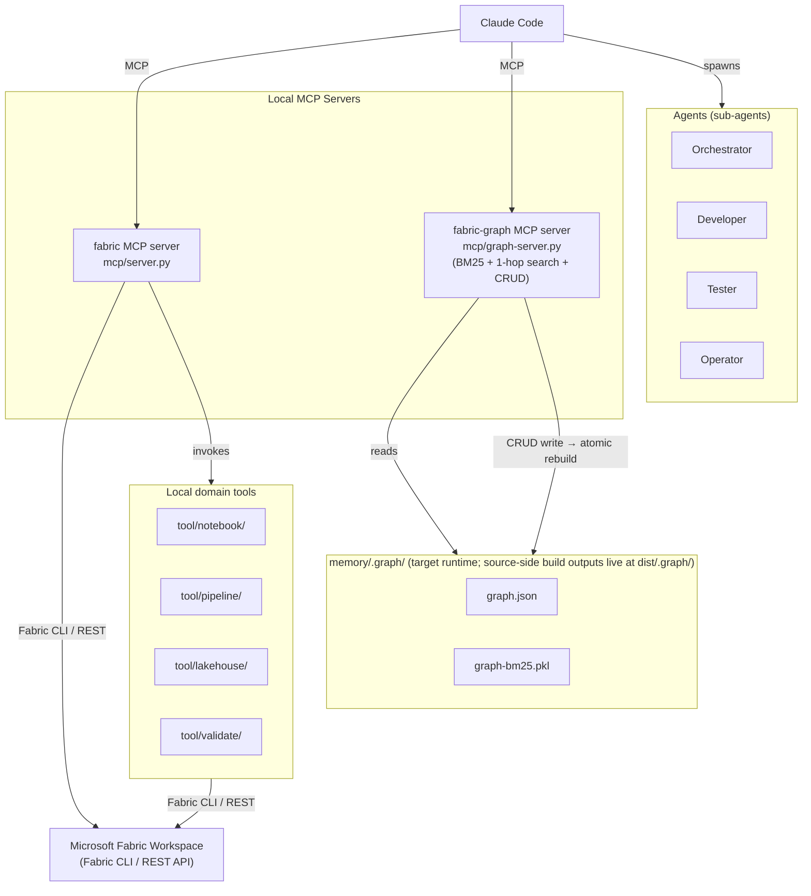
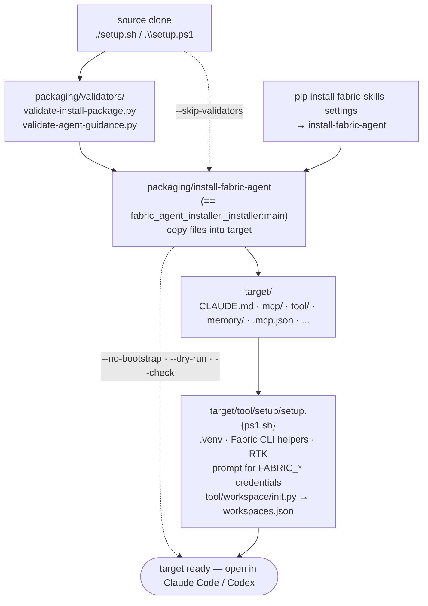

# Architecture

Fabric Agent Pack installs two MCP servers into every target repository. Together they give Claude Code and Codex a structured way to discover project knowledge and act against a Microsoft Fabric workspace.

| Server | Role | Module |
|---|---|---|
| `fabric` | Wraps the Fabric CLI: list/get items, authenticated REST API calls. | `mcp/server.py` |
| `fabric-graph` | RAG knowledge graph: BM25 + 1-hop edge-aware read tools and full CRUD over nodes and edges. | `mcp/graph-server.py` |

The installed `CLAUDE.md` / `AGENTS.md` entrypoints are minimal (~30 lines). They tell the agent to call `graph_get_entry` first and then traverse the graph; all operational knowledge — setup gate, session-start order, workflow steps, skills, tools, rules — is encoded as graph nodes, not as static markdown for the agent to read directly.




## Subagents

Four native subagents are installed alongside the entrypoint:

| Subagent | Owns | Reports to |
|---|---|---|
| `orchestrator` | Scoping, routing, human handoff | Human |
| `developer` | Notebooks, transforms, models, pipelines | `orchestrator` |
| `tester` | DQ, schema drift, RI, metric sanity | `orchestrator` |
| `operator` | Security review, secrets, access, supply chain | `orchestrator` |

Subagents are discovered by Claude and Codex from their native profile directories (`.claude/agents/*.md`, `.codex/agents/*.toml`). They are not primary graph nodes — the capability graph in `memory/.graph/agent-capabilities.json` is a derived inspection artifact only.

## Where things live

| Concern | Source (this repo) | Installed location (target repo) |
|---|---|---|
| Entry instructions | `profiles/claude/CLAUDE.md`, `profiles/codex/AGENTS.md` | Target repo root |
| Subagents | `profiles/{claude,codex}/agents/` | `.claude/agents/`, `.codex/agents/` |
| Skills | `profiles/skills/` | `.claude/skills/`, `.agents/skills/` |
| Rules | `content/rules/*.md` | `memory/rules/*.md` |
| Knowledge graph content | `content/graph-content/` | `memory/graph-content/` |
| Seed memory | `profiles/shared/memory/` | `memory/` |
| Target scaffold (.mcp.json, data/sandbox/, target-side setup overrides, ...) | `profiles/shared/scaffold/` | Target repo root |
| Graph artifacts | `dist/.graph/` (source build output, gitignored) | `memory/.graph/` (shipped by installer + rebuilt by `tool/graph/writes.py` on CRUD) |
| MCP servers | `mcp/` (top-level, parallel to `tool/`) | `mcp/` |
| Graph runtime | `tool/graph/` | `tool/graph/` |
| Source-package CLI + builders + validators | `packaging/` | **not installed** |

## Setup CLI — single-shot install

Both source-clone and pip-install paths land at the same entry point:

| Source path | One-line install |
|---|---|
| Source clone (Linux/macOS) | `./setup.sh --profile claude --target /path/to/project` |
| Source clone (Windows) | `.\setup.ps1 -Profile claude -Target C:\path\to\project` |
| pip-installed wheel | `install-fabric-agent --profile claude --target /path/to/project` |

The source-clone wrappers (`setup.{sh,ps1}`) are thin shells that run the validators (`packaging/validators/validate-install-package.py` and `validate-agent-guidance.py`) and then exec `packaging/install-fabric-agent`. The wheel registers `install-fabric-agent` as a console-script entry point on `fabric_agent_installer._installer:main`, so post-pip-install there is no wrapper — the same Python entry point runs directly. All three paths accept the same flags (`--profile`, `--target`, `--dry-run`, `--check`, `--force`, `--backup`, `--no-bootstrap`).

After the install copies files, the installer automatically invokes `<target>/tool/setup/setup.{ps1,sh}` to finish the bootstrap: create `.venv`, install Fabric CLI helpers (`ms-fabric-cli`, `Faker`, `pandas`, `networkx`, `rank-bm25`, RTK), prompt for any missing `FABRIC_TENANT_ID` / `FABRIC_CLIENT_ID` / `FABRIC_CLIENT_SECRET`, verify auth via `fab-sandbox api workspaces`, and populate `workspaces.json`. Pass `--no-bootstrap` (or `-NoBootstrap` on PowerShell) to skip — `--dry-run` and `--check` skip implicitly.

`./setup.sh` (or `.\setup.ps1`) with **no args** is the maintainer sanity check: tool presence + validators. No target is touched. The wrapper is also where `--install-tools` lives — auto-install `uv` if missing.



## Folder structure

### Source repository (this repo)

```text
fabric-skills-settings/
├── README.md  CLAUDE.md  AGENTS.md  LICENSE  pyproject.toml  uv.lock  .gitignore
├── setup.ps1  setup.sh                  post-clone entry points for maintainers
│
├── packaging/                           source-package internals (NOT installed into targets)
│   ├── install-fabric-agent             CLI shim
│   ├── fabric_agent_installer/          pip-installable wheel package
│   │   ├── __init__.py  __main__.py  _installer.py
│   ├── builders/                        source-only graph builders
│   │   ├── build-graph.py
│   │   ├── build-agent-capability-graph.py
│   │   └── graph_build/                 build-time-only modules (visualize, agent_capabilities)
│   └── validators/                      source-only validators
│       ├── validate-install-package.py
│       └── validate-agent-guidance.py
│
├── tool/                                Fabric runtime helpers (single source of truth)
│   ├── data/  graph/  lakehouse/  notebook/  pipeline/  semantic-model/
│   ├── setup/  validate/  workspace/
│   └── pre-commit-check.{ps1,sh}
│
├── mcp/                                 MCP servers (top-level, parallel to tool/)
│   ├── server.py                        fabric MCP — wraps the Fabric CLI
│   └── graph-server.py                  fabric-graph MCP — knowledge graph
│
├── content/                             installable content sources
│   ├── rules/                           security, data-engineering, fabric-platform, notebook-authoring
│   └── graph-content/                   entry.md, session/, workflow/, layout/, indexes/,
│                                        integrations/, diagnostics/, semantic/
│
├── profiles/
│   ├── claude/                          CLAUDE.md, agents/, settings.local.json
│   ├── codex/                           AGENTS.md, agents/, config.toml
│   ├── skills/                          shared skill source (installed to both .claude/ and .agents/)
│   └── shared/
│       ├── .env.example  .gitignore.fragment
│       ├── memory/                      seed memory (.gitkeep, skill-fixes/) → target memory/
│       └── scaffold/                    target-only scaffolding (.mcp.json, data/sandbox/,
│                                        workspace/, target-side tool/setup/ overrides)
│
├── dist/                                build outputs
│   ├── .graph/                          source-side knowledge-graph artifacts (gitignored)
│   │   ├── graph.json  graph-bm25.pkl
│   │   ├── materialized-graph.{html,svg}
│   │   └── agent-capabilities.{html,json}
│   └── *.whl  *.tar.gz                  wheel + sdist from `uv build`
│
├── docs/
│   └── architecture.md
└── tests/                               pytest suite (includes test_layout.py)
```

Disappeared as part of the redesign: `bin/`, `build/`, `rules/` at root, `profiles/shared/project-layout/`, `profiles/shared/graph-content/`, `tool/mcp/`, source-side `memory/.graph/`.

### Installed target repository (what `install-fabric-agent` produces)

```text
<target-repo>/
├── CLAUDE.md  or  AGENTS.md             from profiles/{claude,codex}/  (hard-minimal stub)
├── .env.example  .gitignore             managed block
├── .mcp.json                            from profiles/shared/scaffold/
│
├── .claude/                             agents/, skills/, settings.local.json   (claude profile)
├── .codex/                              agents/, config.toml                    (codex profile)
├── .agents/skills/                      same skills as .claude/skills/          (codex profile)
│
├── tool/                                Fabric runtime helpers
├── mcp/                                 MCP servers (server.py, graph-server.py)
│
├── memory/                              runtime persistence root
│   ├── .graph/                          shipped pre-built; rebuilt on CRUD writes
│   ├── rules/                           from content/rules/
│   ├── graph-content/                   from content/graph-content/
│   ├── skill-fixes/
│   ├── notebook-authoring.md            from scaffold/memory/
│   └── pipeline-authoring.md
│
├── contracts/  data/sandbox/  workspace/   scaffold placeholders
```