# Deployment Pipeline

End-to-end flow from AI-assisted development to production. Data privacy controls (anonymization pipeline, GDPR boundaries, publisher identity) are documented separately in [GDPR_PATH.md](GDPR_PATH.md). The sandbox receives a safe dataset from that layer — agents never touch raw or PII data.

```mermaid
flowchart TD

    SD["Safe Dataset\n(anonymized · synthetic · aggregated)\nsee GDPR_PATH.md"]

    %% ── SANDBOX ─────────────────────────────────────────────────────────────
    subgraph SBX["SANDBOX  ·  Full agent access"]
        direction TB
        SBX_IN["Anonymized + synthetic data\n(safe workspace · no real data)"]

        subgraph SBX_WORK["Agent work loop"]
            direction LR
            SBX_MOCK["mock-data-generator.py\nschema-driven synthetic CSV\ndata/sandbox/&lt;topic&gt;/"]
            SBX_BUILD["build.py → deploy.py\nnotebook build & deploy"]
            SBX_DQ["DQ notebooks\ndq_bronze · dq_silver · dq_gold\nGreat Expectations"]
        end

        SBX_OP["operator\nsecurity review · PII masking · RLS check\nno writes · read-only"]
        SBX_SYNTH[("Synthetic dataset\ndata/sandbox/&lt;topic&gt;/\nschema-verified · deterministic")]

        SBX_IN --> SBX_MOCK
        SBX_MOCK --> SBX_SYNTH
        SBX_IN --> SBX_BUILD
        SBX_BUILD --> SBX_DQ
        SBX_DQ --> SBX_OP
    end

    %% ── FEATURE-DEV-BRANCH ──────────────────────────────────────────────────
    subgraph FDB["FEATURE-DEV-BRANCH  ·  Fabric workspace feature branch"]
        direction TB
        FDB_WS["Isolated Fabric workspace branch\nno live data · no production credentials"]

        FDB_DATA["Synthetic data from sandbox\ndata/sandbox/&lt;topic&gt;/  ← same files\n⚠ only data source in this stage"]

        subgraph FDB_AGENT["Agent scope  (deploy + smoke-test only)"]
            direction LR
            FDB_DEPLOY["deploy notebooks & pipelines\ntool/notebook/deploy.py\ntool/pipeline/manage.py"]
            FDB_SMOKE["smoke-test.ps1 / .sh\nrun against synthetic data\nvalidate notebook outputs"]
        end

        FDB_PKG["Code package handed to developers\nnotebook sources · pipeline definitions\nDQ contracts · lineage reports\n⚠ agent cannot git commit here"]

        FDB_WS --> FDB_DATA
        FDB_DATA --> FDB_DEPLOY
        FDB_DEPLOY --> FDB_SMOKE
        FDB_SMOKE --> FDB_PKG
    end

    %% ── DEV ─────────────────────────────────────────────────────────────────
    subgraph DEV["DEV  ·  Human validation"]
        direction TB
        DEV_GIT["Human: git commit & pull request\ncode review · inspection"]
        DEV_CHK["Release checklist\nDE-04 quality gates\nFP-03 notebook checks\nSEC-10 / SEC-12 dependency audit"]
        DEV_ENV["Dev environment\nhuman-configured\nlimited / masked data"]
        DEV_GIT --> DEV_CHK
        DEV_CHK --> DEV_ENV
    end

    %% ── PROD ────────────────────────────────────────────────────────────────
    subgraph PROD["PROD  ·  Human controlled"]
        direction TB
        PROD_SETUP["Human setup\ncredentials · IAM · workspace\nlakehouses · warehouses"]
        PROD_PROMOTE["Production promotion\napproval · audit log · Fabric OneLake IAM"]
        PROD_LIVE["Live Fabric workspace\nfull data · monitored\nno agent access — enforced at platform level"]
        PROD_SETUP --> PROD_PROMOTE
        PROD_PROMOTE --> PROD_LIVE
    end

    %% ── CROSS-STAGE FLOWS ───────────────────────────────────────────────────
    SD -->|"safe dataset → agent reads"| SBX_IN

    SBX_OP -->|"APPROVED\noperator clears DQ + security"| FDB_WS
    SBX_SYNTH -->|"synthetic data carried over\n(no new data source in feature-dev)"| FDB_DATA
    SBX_OP -->|"BLOCKED → remediation"| SBX_BUILD

    FDB_PKG -->|"human pulls code\ngit commit + PR"| DEV_GIT
    FDB_PKG -->|"DQ evidence + lineage\nattached to PR"| DEV_GIT

    DEV_ENV -->|"human promotes\nIAM · secrets · prod config"| PROD_SETUP

    %% ── CAPABILITY LEGEND ───────────────────────────────────────────────────
    subgraph LEG["Agent capabilities per stage"]
        direction LR
        L1["SANDBOX\n✓ full AI access\n✓ deploy & run\n✓ anonymized data\n✓ mock data generated here\n✗ real data"]
        L2["FEATURE-DEV-BRANCH\n✓ deploy\n✓ smoke-test with sandbox synthetic data\n✗ new data source\n✗ git commit\n✗ real / production data"]
        L3["DEV\n✗ no agent access\nHuman: review · approve · commit"]
        L4["PROD\n✗ no agent access\nHuman: setup · promote · govern"]
    end
```

## Stage Responsibilities

| Stage | Owner | Agent access | Data source | Can commit / promote |
|---|---|---|---|---|
| **Sandbox** | AI agent | Full — deploy, run, DQ, mock data generation | Anonymized (from publisher) + synthetic (generated here) | No — deploy only to sandbox workspace |
| **Feature-dev-branch** | AI agent (handoff) | Deploy + smoke-test only — no git write | Synthetic data carried over from sandbox — no new data source | No — packages code for developer handoff |
| **Dev** | Human | None | Limited / masked | Yes — human reviews and commits agent output |
| **Prod** | Human | None | Full (production) | Yes — human promotion with IAM and audit |

## Key Boundaries

- **Synthetic data carries across the sandbox/feature-dev boundary**: mock data generated in sandbox (`data/sandbox/<topic>/`) is the only data the agent uses when deploying and smoke-testing in the feature-dev-branch. No live or anonymized data enters that stage — the data separation is explicit and intentional.
- **Feature-dev-branch deploy-only gate**: the agent can deploy and smoke-test but cannot push to git. Developers receive the packaged notebooks and contracts, not raw agent git history.
- **Operator review**: the `operator` agent runs a read-only security and PII review inside sandbox before any handoff to feature-dev-branch. A BLOCKED result loops back to the developer.
- **Human gates at Dev and Prod**: no automation crosses into dev or production without explicit human approval, git commit, and IAM-controlled promotion.
