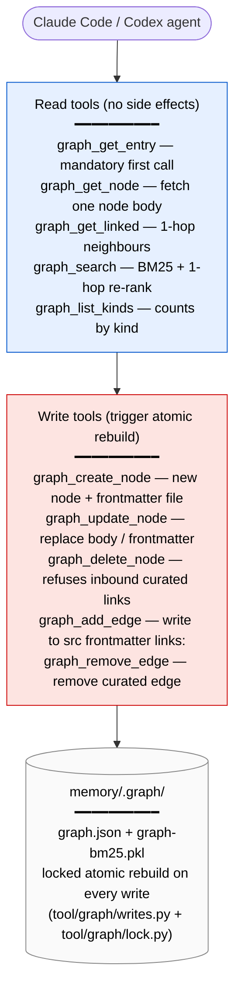

# Knowledge graph — what gets indexed

What the **target repo** has under `memory/` after `fabric-agents install` runs, and what shape it has as a graph. Reads top-down: the agent enters at `entry.md`, then traverses outward to session bootstrap → workflow → skills → rules.

```mermaid
flowchart TD
    classDef entry fill:#fff4e6,stroke:#cc7700,stroke-width:3px,color:#000
    classDef cat fill:#e6f0ff,stroke:#0055cc,color:#000
    classDef rule fill:#e6ffe6,stroke:#00aa00,color:#000
    classDef skill fill:#fde4e1,stroke:#cc0000,color:#000
    classDef fix fill:#f3e6ff,stroke:#6633cc,color:#000

    ENTRY["entry.md<br/>━━━━━━━━━━<br/>mandatory setup gate<br/>graph_get_entry returns this"]:::entry
    ENTRY --> SESSION

    SESSION["session/<br/>━━━━━━━━━━<br/>session-start.md — read order<br/>operating-rules.md — safety + workflow"]:::cat
    SESSION --> WORKFLOW

    WORKFLOW["workflow/<br/>━━━━━━━━━━<br/>notebook-workflow.md — author → build → deploy → smoke → fetch<br/>pipeline-structure.md — download → bronze → dq pattern<br/>workspace-management.md — init · switch · transfer"]:::cat
    WORKFLOW --> LAYOUT

    LAYOUT["layout/<br/>━━━━━━━━━━<br/>directory-layout.md — workspace/ · fabric_notebooks/<br/>tool-layout.md — tool/ + mcp/ inventory"]:::cat
    LAYOUT --> INDEXES

    INDEXES["indexes/<br/>━━━━━━━━━━<br/>skills-index.md — registry of all 14 skills"]:::cat
    INDEXES --> SKILLS

    SKILLS["skills/  (14 nodes)<br/>━━━━━━━━━━<br/>data engineering ⇒ fabric-ingest · fabric-transform · fabric-model · fabric-validate<br/>fabric ops ⇒ fabric-notebook-loop · fabric-pipeline · fabric-ops · semantic-model · mock-data<br/>meta ⇒ prd · grill-me · git-commit · caveman · rtk"]:::skill
    SKILLS --> RULES

    RULES["rules/  (4 nodes)<br/>━━━━━━━━━━<br/>security — credentials · PII · secrets<br/>data-engineering — idempotent MERGE · DQ · contracts<br/>fabric-platform — fabric-cli · workspaces.json<br/>notebook-authoring — kernel · packages · params"]:::rule
    RULES --> EXTRA

    EXTRA["semantic/ · integrations/ · diagnostics/<br/>━━━━━━━━━━<br/>semantic-models.md — list/inspect models<br/>rtk.md — token-optimizer integration<br/>smoke-test-diagnostics.md — failure triage"]:::cat
    EXTRA --> FIX

    FIX["skill-fixes/<br/>━━━━━━━━━━<br/>runtime overrides for SKILL.md defaults<br/>created by agents via graph_create_node<br/>(0 at install · grows at runtime)"]:::fix
```

## What lives where in the target

| Path | Node kind | Origin |
|---|---|---|
| `memory/graph-content/entry.md` | `entry` (always exactly 1) | shipped from `content/graph-content/` |
| `memory/graph-content/{session,workflow,layout,indexes,integrations,diagnostics,semantic}/*.md` | `content` | shipped from `content/graph-content/` |
| `memory/rules/*.md` | `rule` (4 nodes) | shipped from `content/rules/` |
| `.claude/skills/<name>/SKILL.md` and `.agents/skills/<name>/SKILL.md` | `skill` (14 nodes; deduplicated by id) | shipped from `profiles/skills/` |
| `memory/skill-fixes/*.md` | `skill-fix` (0 at install; grows at runtime) | created by agents through `graph_create_node` |
| `memory/.graph/graph.json` | networkx-backed adjacency + frontmatter | shipped pre-built; rebuilt atomically on every CRUD write |
| `memory/.graph/graph-bm25.pkl` | BM25 search index | same — atomic rebuild on every CRUD write |

## Edges

| Edge kind | How it's created | Survives a rebuild? |
|---|---|---|
| **Curated** | Author writes `links: [other/node]` in node frontmatter | Yes — re-resolved on rebuild |
| **Auto-path** | Builder finds a raw `path/to/file.md` mention in prose | Yes — re-extracted on rebuild |
| Wiki-links (`[[name]]`) | **Not supported** by design | n/a |

Curated edges are the contract; auto edges are the safety net so a forgotten frontmatter link doesn't hide a real dependency.

## How agents touch the graph (MCP surface)

The `fabric-graph` MCP server (`mcp/graph-server.py`) is the only thing that touches `memory/.graph/`. Every write call serialises the whole graph atomically via `tool/graph/writes.py` and the cross-platform file lock at `tool/graph/lock.py`. Agents are forbidden from editing `memory/.graph/*` directly.

See [workflow.md](workflow.md) for the agent → skill → tool side, and [architecture.md](architecture.md) for the full source-vs-target picture.
