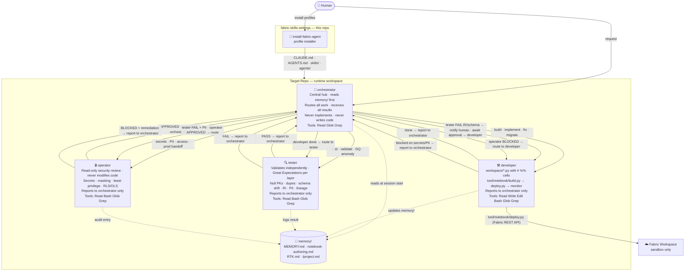
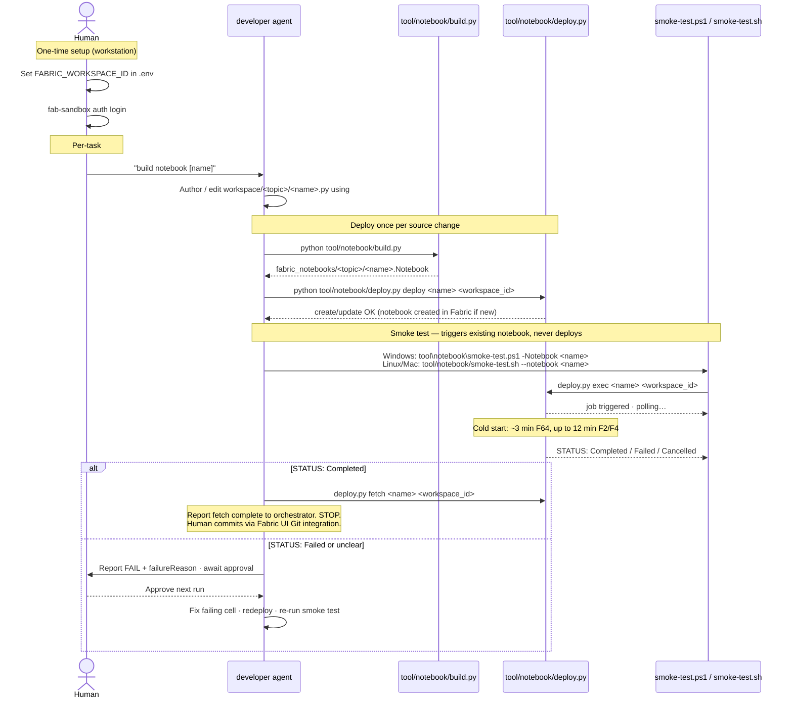
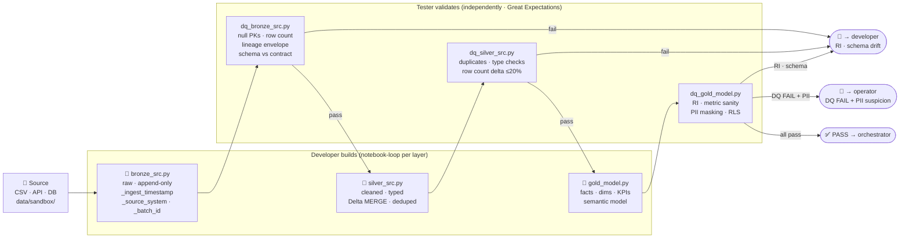

# Learn more: Fabric Agent Pack architecture and operating model

This guide contains the extra context that used to make the README long. It separates what humans need to understand from what agents and automation need to follow.

## Human view

Humans use this repository to install an agent profile into a separate Fabric project repository. After installation, humans should work in the target repository and ask Codex or Claude Code to perform Fabric data engineering tasks there.

Human responsibilities:

- Choose the target repository and install the desired profile.
- Provide or approve Fabric workspace configuration.
- Prefer service-principal credentials for auditable agent activity.
- Review failed or unclear Fabric runs before another execution is attempted.
- Review security, data-quality, and release handoffs before production use.

## Machine view

Agents and automation treat the installed target repository as the runtime workspace.

Machine responsibilities:

- Read `memory/` at session start and update it when project state changes.
- Keep implementation, testing, and security-review roles separate.
- Author Fabric notebook source as local `.py` files with `# %%` cell markers.
- Build notebook bundles before deployment.
- Deploy notebooks through the Fabric REST API helper, not by editing notebooks in the Fabric portal.
- Smoke-test existing deployed notebooks as a separate step from deployment.
- Preserve data-quality, lineage, and security checks as explicit workflow gates.

## How it works



## Target repository `tool/` layout

The Shared profile installs five tool groups into every target repository:

| Directory | Who runs it | Purpose |
|---|---|---|
| `tool/setup/` | Human, one-time | Environment setup and Fabric admin helpers: `setup.ps1`, `setup.sh`, `fab-sandbox`, `fabric-inventory-readonly` |
| `tool/notebook/` | Developer agent | Notebook build → deploy → smoke-test cycle: `build.py`, `deploy.py`, `smoke-test.ps1/sh` |
| `tool/lakehouse/` | Developer agent | `list-tables.py` — read-only inventory of lakehouse tables with column names and types |
| `tool/pipeline/` | Developer agent | `manage.py` — create, deploy, run, and monitor a Data Factory pipeline that chains all topic notebooks |
| `tool/validate/` | Developer agent | Pre-deploy gates: `pipeline-lineage.py` for staging path consistency and `source-contract.py` for contract YAML shape |
| `tool/mcp/` | Infrastructure | MCP server exposing Fabric CLI commands to agents |
| `tool/pre-commit-check.ps1/sh` | Developer agent | Runs validators before committing workspace changes |

## Notebook deploy loop

The developer never uses the Fabric portal to edit notebooks. All changes happen in local `.py` files and are deployed through the Fabric REST API. Deploy and smoke test are separate steps; the smoke test never deploys.



`fab import` and `fab job run` require an interactive Windows console and fail in Git Bash or sandboxed environments. `tool/notebook/deploy.py` uses `fab api` calls through the CLI, which works across supported environments. On Windows it routes through `tool/setup/fab-sandbox.ps1` to keep the authenticated `fab` profile isolated. It also enables `_inlineInstallationEnabled` on triggered runs so `%pip install` cells work when a notebook starts through the API.

## Medallion pipeline flow

DQ notebooks are always separate files from ingestion notebooks. The tester validates each layer independently using Great Expectations.



## Fabric notebook authoring rules

These rules apply inside every `workspace/<topic>/*.py` notebook source file:

| Rule | Correct | Wrong |
|---|---|---|
| Lakehouse paths | `Files/data/sandbox/topic/file.csv` | `/lakehouse/default/Files/...` |
| Non-standard packages | `%pip install "pkg>=x,<y"` as first cell | Import at top when runtime lacks package |
| Pipeline path alignment | Shared `FABRIC_STAGING_DIR` constant; run `python tool/validate/pipeline-lineage.py` before build | Hard-coded or mismatched strings |
| Fabric vs local portability | `mssparkutils` detection and relative fallback | Hard Fabric assumption |

## Safety behavior

`bin/install-fabric-agent` requires a git target, refuses to install into this source repo unless `--self-test` is passed, protects unmanaged files by default, supports `--backup`, and merges a managed `.gitignore` block idempotently.

## Validation commands

Run these from this source package repository. They validate the installer package and profile guidance; they are not installed into target repositories.

```bash
python3 bin/validate-install-package.py
python3 bin/validate-agent-guidance.py
```

To check that an installed target repository is still aligned with this package, run the installer check from this source repository:

```bash
python3 bin/install-fabric-agent --profile all --target /path/to/project-repo --check
```

For installer changes, also run a disposable-target smoke test:

```bash
tmp=$(mktemp -d)
git init -q "$tmp"
./bin/install-fabric-agent --profile all --target "$tmp" --dry-run
./bin/install-fabric-agent --profile all --target "$tmp"
./bin/install-fabric-agent --profile all --target "$tmp" --check
```
