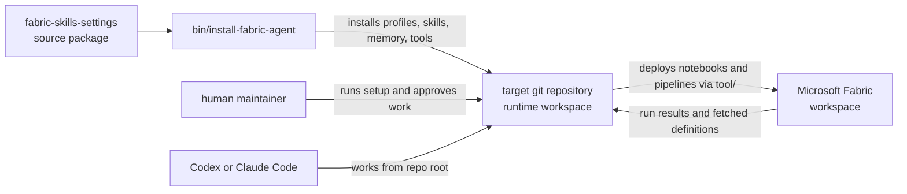
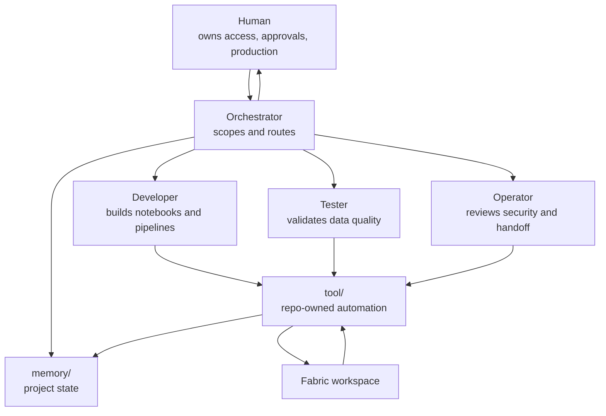
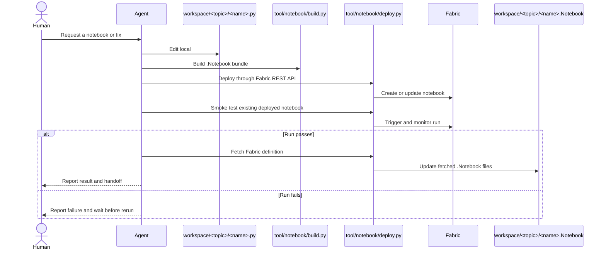
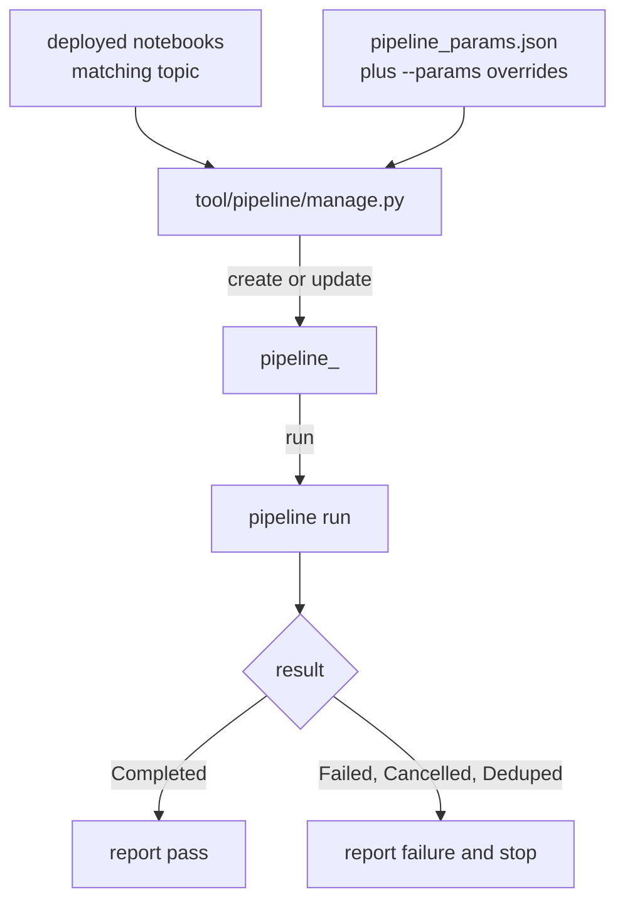

# Learn More: Fabric Agent Pack

Fabric Agent Pack is a starter system for building Microsoft Fabric data projects with Codex or Claude Code. It gives a normal git repository the working shape of a Fabric project: profile guidance, role-specific agents, skills, memory, setup scripts, notebook deployment tools, validation helpers, and pipeline automation.

The main idea is simple: humans own the project, credentials, approvals, and production decisions; agents work inside the target repository and use repo-owned tools to build, deploy, validate, and report.

## The Shape

This repository is the package. A target repository is the actual Fabric project.



The package installs two kinds of things:

| Installed asset | Why it matters |
|---|---|
| `AGENTS.md` / `CLAUDE.md` | Tells the agent how to behave in a Fabric project. |
| `.agents/skills` or `.claude/skills` | Gives task-specific playbooks for ingestion, validation, operations, and modeling. |
| `memory/` | Keeps project state and lessons available across sessions. |
| `tool/setup/` | Helps humans configure local Fabric access safely. |
| `tool/notebook/` | Builds, deploys, runs, monitors, and fetches notebooks. |
| `tool/pipeline/` | Creates and runs Data Factory pipelines from deployed notebooks. |
| `tool/validate/` | Catches path, contract, and lineage mistakes before deploy. |
| `tool/mcp/` | Gives agents safe Fabric discovery through MCP. |

## Why This Pattern

Fabric projects are easy to make inconsistent when notebook edits happen partly in the portal, partly in local files, and partly through one-off commands. This pack makes the repository the working center:

- Local notebook sources are edited in `workspace/<topic>/`.
- Build artifacts go to `fabric_notebooks/` and are not committed.
- Fabric is updated through `tool/notebook/deploy.py`.
- Passing Fabric definitions are fetched back into `workspace/<topic>/<name>.Notebook/`.
- Humans review and commit through the normal project process.

That gives new contributors a visible path from source code to Fabric run result, instead of a scattered set of portal actions.

## Human And Agent Roles

Humans create the Fabric workspace, service principal, lakehouses, warehouses, and production approvals. Agents do the repo-local engineering work and stop when they need human judgment.



The practical rule is: agents can create and update notebooks, workspace folders, and development pipelines through the installed tools. Humans own credentials, secrets, lakehouse and warehouse creation, production promotion, and git handoff.

## Setup In A Target Repo

After installing the profile, the human runs one setup command from the target repository:

```powershell
.\tool\setup\setup.ps1
```

```bash
bash tool/setup/setup.sh
```

Setup checks local tools, installs `ms-fabric-cli` if needed, initializes RTK when possible, prompts for Fabric service-principal settings, and verifies that Fabric API access works.

| Value | Stored where |
|---|---|
| `FABRIC_WORKSPACE_ID` | `.env` |
| `FABRIC_TENANT_ID` | `.env` |
| `FABRIC_CLIENT_ID` | `.env` |
| `FABRIC_CLIENT_SECRET` | OS user environment, never `.env` |

Agents should not inspect secrets. Runtime helpers load `.env` inside their own process when they need configuration.

## Notebook Loop

The notebook loop is the core workflow.



The commands are intentionally boring:

```bash
python tool/validate/pipeline-lineage.py
python tool/notebook/build.py
python tool/notebook/deploy.py deploy <name> <workspace_id>
python tool/notebook/deploy.py fetch <name> <workspace_id>
```

Smoke tests trigger what is already deployed; they do not deploy:

```powershell
powershell -ExecutionPolicy Bypass -File tool/notebook/smoke-test.ps1 -Notebook <name>
```

```bash
bash tool/notebook/smoke-test.sh --notebook <name>
```

## Medallion Inspiration

A good Fabric topic is easy to reason about because each notebook has one job. Downloaders stage raw files. Bronze notebooks ingest. DQ notebooks validate. Silver and Gold notebooks transform and model.

```mermaid
flowchart LR
    Source["source API or file"]
    Download["download_<source>"]
    Sandbox["data/sandbox"]
    Bronze["bronze_<source>"]
    DqBronze["dq_bronze_<source>"]
    Silver["silver_<source>"]
    DqSilver["dq_silver_<source>"]
    Gold["gold_<model>"]
    DqGold["dq_gold_<model>"]
    Handoff["validated handoff"]

    Source --> Download
    Download --> Sandbox
    Sandbox --> Bronze
    Bronze --> DqBronze
    DqBronze -->|pass| Silver
    Silver --> DqSilver
    DqSilver -->|pass| Gold
    Gold --> DqGold
    DqGold -->|pass| Handoff
```



For a Bronze-only topic, start with three notebooks:

| Notebook | Purpose |
|---|---|
| `download_<source>.py` | Fetch raw source files and skip files already staged. |
| `bronze_<source>.py` | Process only new staged files and write the Bronze table. |
| `dq_bronze_<source>.py` | Run independent checks and fail loudly on bad data. |

This split keeps failures understandable. If a source API changes, fix the downloader. If table logic breaks, fix Bronze. If quality rules fail, inspect DQ output before rerunning.

## Pipeline Flow

Once notebooks are deployed, `tool/pipeline/manage.py` can chain them into a Fabric Data Factory pipeline.



Common commands:

```bash
python tool/pipeline/manage.py create --topic <topic>
python tool/pipeline/manage.py test --topic <topic>
python tool/pipeline/manage.py status --pipeline pipeline_<topic> --instance <job-instance-id>
python tool/pipeline/manage.py list
```

Auto-discovery orders notebooks by familiar prefixes:

```text
download_ -> bronze_ -> dq_bronze_ -> silver_ -> dq_silver_ -> gold_ -> dq_gold_
```

Use `--notebooks name1,name2` when a topic needs a custom order.

## Authoring Rules Worth Remembering

| Need | Use |
|---|---|
| Python kernel | `# FABRIC_KERNEL: python` |
| Lakehouse attachment | `# FABRIC_LAKEHOUSE: bronze` |
| Warehouse attachment | `# FABRIC_WAREHOUSE: data_warehouse` |
| Lakehouse file path | `Files/data/sandbox/topic/file.csv` |
| Runtime package | `%pip install "pkg>=x,<y"` before import |
| Pipeline parameters | `# %% [parameters]` cells |

Avoid portal-only notebook edits, hard-coded `/lakehouse/default/Files/...` paths, committed `.env` files, committed `fabric_notebooks/` bundles, and combined download-plus-ingest notebooks.

## Maintainer Checks

When changing this source package, run:

```bash
uv run bin/validate-install-package.py
uv run bin/validate-agent-guidance.py
uv run --group dev pytest
```

When changing installer mappings or profile files, also check a disposable target repository:

```bash
tmp=$(mktemp -d)
git init -q "$tmp"
python bin/install-fabric-agent --profile all --target "$tmp" --dry-run
python bin/install-fabric-agent --profile all --target "$tmp"
python bin/install-fabric-agent --profile all --target "$tmp" --check
```
