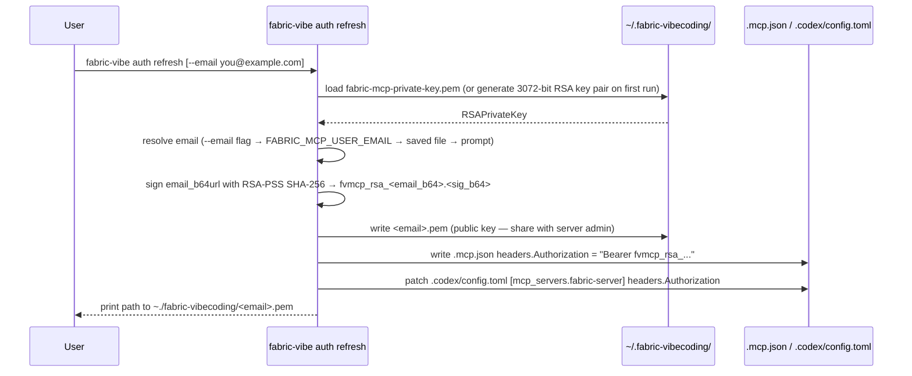
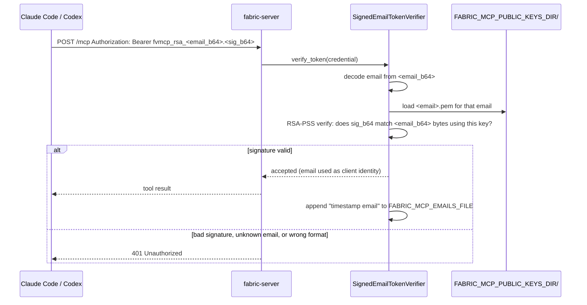

# MCP auth flow

The `fabric-server` FastMCP server authenticates clients by **verifying an RSA signature**: the client signs its email address with its private key, the server checks the signature against the registered public key for that email. No JWTs, no OAuth tokens — just a proof that you hold the private key.

Auth is opt-in: when `FABRIC_MCP_PUBLIC_KEYS_DIR` is unset the server accepts all requests (single-user local dev).

## Overview

```
Client (user's laptop)                    Server (Docker 127.0.0.1:8000)
──────────────────────                    ───────────────────────────────
~/.fabric-vibecoding/
  fabric-mcp-private-key.pem  ──signs──►  Bearer fvmcp_rsa_<email_b64>.<sig_b64>
  <email>.pem  ──────────────────────────► server/keys/<email>.pem  (admin deploys)
                                               │
                                          verify RSA-PSS signature:
                                          does sig match email using <email>.pem?
                                               │
                                               ▼
                                          /data/authenticated-emails.txt (audit)
```

## Bearer credential format

```
fvmcp_rsa_<email_b64url>.<signature_b64url>
```

- `fvmcp_rsa_` — fixed prefix, identifies the scheme
- `<email_b64url>` — URL-safe base64 (no padding) of the raw email string
- `<signature_b64url>` — URL-safe base64 (no padding) of the RSA-PSS SHA-256 signature over `<email_b64url>` (i.e. the ASCII bytes of the already-encoded email)

This is a **custom format**, not a JWT. The server never decodes a header or validates expiry — it only checks whether the signature is valid for the public key registered under the claimed email.

## Client side — `fabric-vibe auth refresh`

Driven by `cli/tools/auth/refresh.py`, invoked by `setup.sh` / `setup.ps1` and re-runnable at any time.



Key files written (all under `~/.fabric-vibecoding/`):

| File | Contents | Stays on machine |
|---|---|---|
| `fabric-mcp-private-key.pem` | 3072-bit RSA private key, PKCS8, unencrypted, `chmod 600` | Yes — never shared |
| `<email>.pem` | Matching RSA public key, SubjectPublicKeyInfo PEM | No — send to server admin |

The signed credential is re-generated on every `auth refresh` run. The private key is reused across refreshes unless deleted manually.

## Server side — `SignedEmailTokenVerifier`

Implemented in `server/app.py`. Plugged into FastMCP's `TokenVerifier` interface.



### Validation rules

- The credential claims email X; the server verifies the signature **using only the key registered under email X** — a credential signed by user B's private key cannot pass under user A's email.
- Accepted credentials are cached in memory for 300 seconds to avoid re-verifying on every call.
- Auth is **disabled entirely** when `FABRIC_MCP_PUBLIC_KEYS_DIR` is unset or empty.

## Server configuration

### docker-compose.yml

```yaml
services:
  server:
    environment:
      MCP_SERVER_URL: ${MCP_SERVER_URL:-http://127.0.0.1:8000}
      FABRIC_MCP_PUBLIC_KEYS_DIR: /keys
      FABRIC_MCP_EMAILS_FILE: /data/authenticated-emails.txt
    volumes:
      - ./keys:/keys:ro     # one <email>.pem per authorised user
      - ./data:/data        # audit log persisted on host
    ports:
      - "127.0.0.1:8000:8000"
```

`./keys/` is where the admin places the PEM files that users send after running `fabric-vibe auth refresh`. Adding a new user requires dropping their file and restarting the container (the key map is loaded at startup).

### Environment variables

| Variable | Default | Purpose |
|---|---|---|
| `FABRIC_MCP_PUBLIC_KEYS_DIR` | _(unset)_ | Directory of `<email>.pem` files. Auth disabled when unset. |
| `FABRIC_MCP_EMAILS_FILE` | _(unset)_ | Append-only log of authenticated emails. Skipped when unset. |
| `MCP_SERVER_URL` | derived from `HOST`+`PORT` | Reported back in the FastMCP auth settings for client discovery. |
| `FABRIC_CORS_ORIGINS` | `*` | Comma-separated allowed CORS origins. Tighten for non-local deployments. |

## Setup flow (end to end)

`setup.sh` / `setup.ps1` runs `fabric-vibe auth refresh` during bootstrap:

1. Prompt for `FABRIC_MCP_USER_EMAIL`
2. Write `.mcp.json` with the MCP URL (no auth header yet)
3. Call `fabric-vibe auth refresh --email <email>`
   - generates / loads RSA key pair under `~/.fabric-vibecoding/`
   - signs the email, writes the `Authorization: Bearer …` header into `.mcp.json` and `.codex/config.toml`
   - prints the path to `~/.fabric-vibecoding/<email>.pem`
4. User sends the PEM file to the MCP server admin
5. Admin places it in `server/keys/` and restarts the container

## Audit logging

Every tool call is logged as a structured JSON line by `server/audit.py` (argument values replaced with a SHA-256 hash). Separately, each newly seen authenticated email is appended to `FABRIC_MCP_EMAILS_FILE`:

```
2026-05-27T20:00:00+00:00 you@example.com
```
