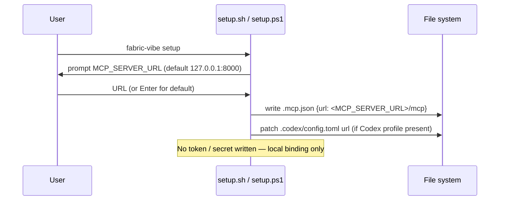
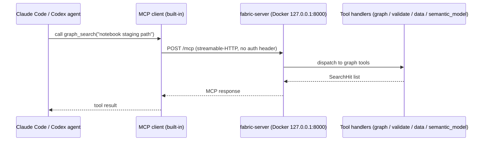

# MCP auth flow

The `fabric-server` FastMCP server uses **no built-in authentication**. Access control is delegated to the transport layer: the server binds to `127.0.0.1:8000` inside Docker (host-only port mapping), so only processes on the local machine can reach it.

## Current setup (no token auth)

`docker-compose.yml` maps the port as `127.0.0.1:8000:8000`, preventing any external network access. The `.mcp.json` written by `setup.sh` / `setup.ps1` points at this local endpoint with no headers:

```json
{
  "mcpServers": {
    "fabric-server": {
      "type": "http",
      "url": "http://127.0.0.1:8000/mcp"
    }
  }
}
```

Claude Code and Codex send all MCP requests to this URL with no additional credentials.

## Setup flow — how `.mcp.json` is written

`setup.sh` (and its PowerShell equivalent `setup.ps1`) prompts for `MCP_SERVER_URL` (default `http://127.0.0.1:8000`) and writes `.mcp.json` with the concrete endpoint at the end. It also patches `.codex/config.toml`'s `[mcp_servers.fabric-server]` url if the Codex profile is installed.



## Request flow at runtime



## CORS

`app.py` wraps the FastMCP streamable-HTTP app with Starlette `CORSMiddleware`. Allowed origins are controlled by `FABRIC_CORS_ORIGINS` (comma-separated; defaults to `*` for local dev). Tighten this env var for any deployment beyond `127.0.0.1`.

## Audit logging

Every tool call is logged to stdout as a structured JSON line by `server/audit.py`. Argument values are **never logged raw** — only a SHA-256 (first 16 chars) hash of the JSON-serialised arguments. The container's stdout is the log stream (picked up by `docker logs`, App Insights, Loki, etc.).

```json
{"ts":"2026-05-27T20:00:00+00:00","tool":"graph_search","args_hash":"a3f9c2d1e4b78012","status":"ok","latency_ms":12}
```

## Remote deployment (non-default)

If `MCP_SERVER_URL` is set to a remote host, the user is responsible for securing the endpoint (reverse proxy with TLS and auth, VPN, etc.). The server itself ships no token-verification middleware — that is an ops concern outside this package.
