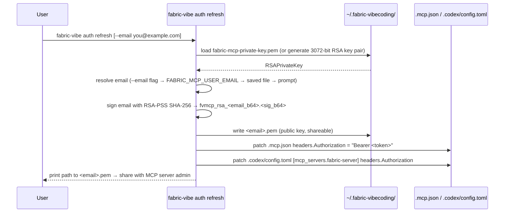
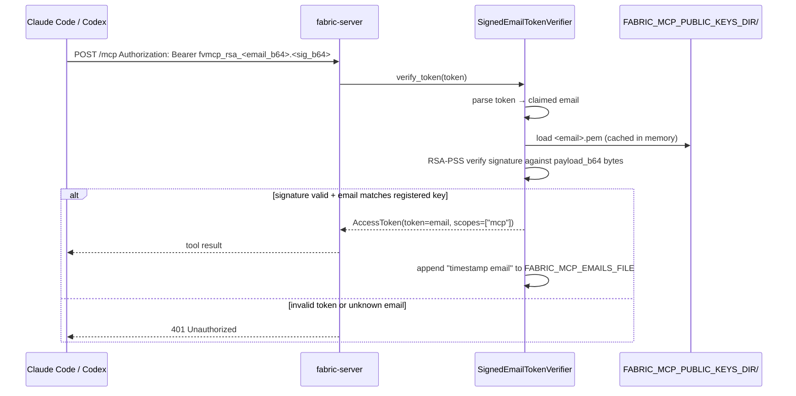

# MCP auth flow

The `fabric-server` FastMCP server uses **RSA-signed email tokens** for MCP access. Auth is opt-in: if `FABRIC_MCP_PUBLIC_KEYS_DIR` is not set the server accepts unauthenticated requests, falling back to host-only port protection.

## Overview

```
Client (user's laptop)                   Server (Docker 127.0.0.1:8000)
─────────────────────                    ───────────────────────────────
~/.fabric-vibecoding/
  fabric-mcp-private-key.pem  ──signs──► bearer token in .mcp.json
  <email>.pem ─────────────────────────► server/keys/<email>.pem (admin deploys)
                                              │
                                         SignedEmailTokenVerifier
                                              │  verify RSA-PSS signature
                                              │  email from token must match key
                                              ▼
                                         /data/authenticated-emails.txt (audit)
```

## Token format

```
fvmcp_rsa_<email_b64url>.<signature_b64url>
```

- `fvmcp_rsa_` — fixed prefix
- `<email_b64url>` — URL-safe base64 (no padding) of the raw email string
- `<signature_b64url>` — URL-safe base64 (no padding) of the RSA-PSS SHA-256 signature over the b64url-encoded email bytes

## Client side — `fabric-vibe auth refresh`

Driven by `cli/tools/auth/refresh.py`, called by `setup.sh` / `setup.ps1` at bootstrap and re-runnable at any time.



Key files written (all under `~/.fabric-vibecoding/`):

| File | Contents | Who sees it |
|---|---|---|
| `fabric-mcp-private-key.pem` | 3072-bit RSA private key, PKCS8, unencrypted, `chmod 600` | Never leaves the user's machine |
| `<email>.pem` | Matching RSA public key, SubjectPublicKeyInfo PEM | Sent to MCP server admin |

The token is re-generated on every run of `auth refresh`. The private key is reused across refreshes.

## Server side — `SignedEmailTokenVerifier`

Implemented in `server/app.py`. Auth is wired into FastMCP's `TokenVerifier` interface.



### Key validation rules

- The token claims email X; the server looks up the public key **registered under email X specifically** — a token signed by user B's key cannot impersonate user A's email.
- Accepted tokens are cached for 300 seconds (TTL) to avoid re-verifying on every tool call.
- Auth is **disabled entirely** when `FABRIC_MCP_PUBLIC_KEYS_DIR` is unset or empty — the server accepts all requests (local dev / single-user setups).

## Server configuration

### docker-compose.yml

```yaml
services:
  server:
    environment:
      MCP_SERVER_URL: ${MCP_SERVER_URL:-http://127.0.0.1:8000}
      FABRIC_MCP_PUBLIC_KEYS_DIR: /keys
      FABRIC_MCP_EMAILS_FILE: /data/authenticated-emails.txt
    volumes:
      - ./keys:/keys:ro     # one <email>.pem per authorised user
      - ./data:/data        # audit log persisted on host
    ports:
      - "127.0.0.1:8000:8000"
```

The `./keys/` directory on the host is where the admin drops the PEM files sent by users after running `fabric-vibe auth refresh`. No server restart is needed — the key map is re-read on startup; to add a new user, restart the container after adding the file.

### Environment variables

| Variable | Default | Purpose |
|---|---|---|
| `FABRIC_MCP_PUBLIC_KEYS_DIR` | _(unset)_ | Path to directory of `<email>.pem` files. Auth disabled when unset. |
| `FABRIC_MCP_EMAILS_FILE` | _(unset)_ | Append-only audit log of authenticated emails. Skipped when unset. |
| `MCP_SERVER_URL` | derived from `HOST`+`PORT` | Used as the OAuth resource server URL in `AuthSettings`. |
| `FABRIC_CORS_ORIGINS` | `*` | Comma-separated allowed CORS origins. Tighten for non-local deployments. |

## Setup flow (end to end)

`setup.sh` / `setup.ps1` runs `fabric-vibe auth refresh` as the final step before workspace init:

1. Prompt for `FABRIC_MCP_USER_EMAIL`
2. Write `.mcp.json` with the MCP URL (no auth header yet)
3. Call `fabric-vibe auth refresh --email <email>`
   - generates / loads RSA key pair
   - signs email → bearer token
   - patches `.mcp.json` and `.codex/config.toml` with `Authorization: Bearer <token>`
   - prints path to `~/.fabric-vibecoding/<email>.pem`
4. User sends the PEM file to the MCP server admin
5. Admin drops it into `server/keys/` and restarts the container

## Audit logging

Every tool call is logged as a structured JSON line by `server/audit.py`. Argument values are never logged raw — only a SHA-256 (first 16 chars) hash. Separately, every newly authenticated email is appended to `FABRIC_MCP_EMAILS_FILE`:

```
2026-05-27T20:00:00+00:00 you@example.com
```
