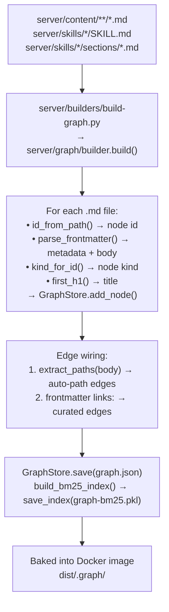
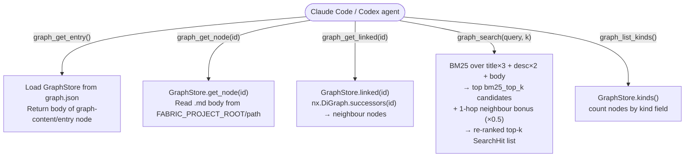
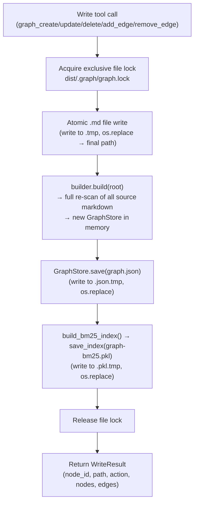

# Knowledge graph — networkx runtime flow

The knowledge graph is a `networkx.DiGraph` backed by two artifact files baked into the Docker image at build time and atomically rebuilt on every CRUD write at runtime.

## Artifact files

| File | Contents |
|---|---|
| `dist/.graph/graph.json` | All nodes (id, path, title, description, kind, frontmatter, mtime) and edges (src, dst, kind) serialised as JSON. Schema version 1. |
| `dist/.graph/graph-bm25.pkl` | Pickled `BM25Okapi` corpus (title ×3 + description ×2 + body tokens) and the corresponding node-id list. |

Inside Docker: `FABRIC_GRAPH_DIR=/app/dist/.graph`.

## Build-time graph construction (Dockerfile / builder)

### Node discovery order (pattern priority)

`builder.py` discovers files in this order; when two paths resolve to the same node id the first match wins:

1. `server/content/rules/*.md` → `rule`
2. `server/content/skill-fixes/*.md` → `skill-fix`
3. `server/content/memory/**/*.md` → `memory`
4. `server/content/**/*.md` → `content`
5. `server/skills/*/SKILL.md` → `skill`
6. `server/skills/*/sections/*.md` → `content`

### Edge kinds

| Kind | Source | Survives rebuild? |
|---|---|---|
| `curated` | `links:` frontmatter list | Yes — re-resolved on every rebuild |
| `auto-path` | Bare `path/to/file.md` mention in body prose | Yes — re-extracted on every rebuild |

Curated edges take precedence: if a `curated` edge exists for a pair, the `auto-path` edge is dropped.

## Runtime — read path

### BM25 + 1-hop re-rank detail

`search.py` runs a two-phase ranking:

1. **BM25 pass** — `BM25Okapi.get_scores(tokens)` over the full corpus; take top `bm25_top_k` (default 10) candidates.
2. **1-hop bonus** — for each candidate `n` with score `s`, each out-neighbour `m` in the candidate pool contributes `0.5 × score(m)` back to `n`. This surfaces nodes structurally adjacent to direct matches.

The index is loaded lazily from `graph-bm25.pkl` and re-read whenever the file's mtime changes (i.e. after any write).

## Runtime — write path (atomic rebuild)

Every write tool (`graph_create_node`, `graph_update_node`, `graph_delete_node`, `graph_add_edge`, `graph_remove_edge`) follows the same pattern:

The full rebuild is intentional: the markdown files are the source of truth; the graph artifacts are derived. For the ~50-node corpus this pack targets, a full rebuild on every write is fast and keeps the logic simple.

### Safety invariants

- **Lock**: `graph.lock` (cross-platform `fcntl` / `msvcrt` file lock in `server/graph/lock.py`) serialises concurrent writes.
- **Atomic files**: `.tmp` + `os.replace()` for every file mutation — no partial writes visible to readers.
- **Delete guard**: `graph_delete_node` refuses to delete a node that has inbound curated edges unless `allow_orphans=True` is passed.
- **Path traversal guard**: `_resolve_graph_path` rejects absolute paths, `..` segments, and paths that escape the repo root.

## GraphStore internals

`server/graph/store.py` wraps `nx.DiGraph`. Key operations:

| Method | What it does |
|---|---|
| `add_node(node)` | Adds node attrs dict to the DiGraph |
| `get_node(id)` | Returns `Node` from DiGraph node data |
| `add_edge(edge)` | Adds edge; curated overrides auto-path for the same pair |
| `linked(id, kinds)` | Returns `successors(id)` filtered by kind |
| `kinds()` | Counts nodes by `kind` field |
| `save(path)` | Serialises to JSON via tmp+replace under file lock |
| `load(path)` | Deserialises from JSON; validates schema version |
