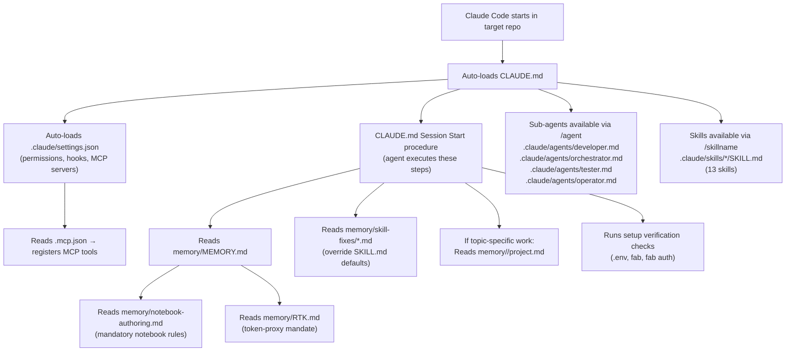
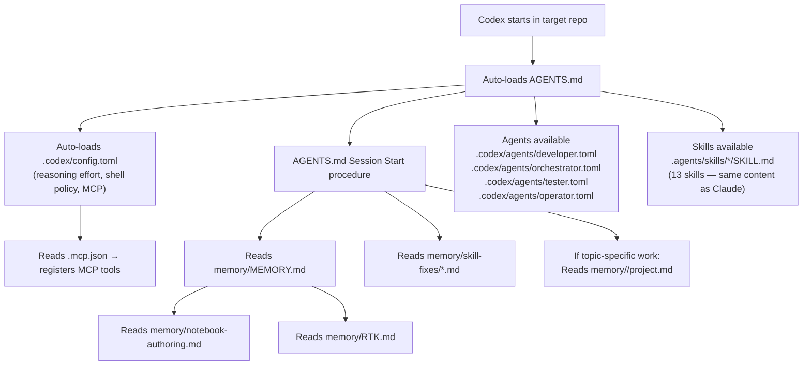

# Auto-Loaded Setup — Claude and Codex

What each runtime loads automatically when started in a target repository (after `fabric-skills-settings install`).

## Installation targets

| Source path | Claude target | Codex target |
|---|---|---|
| `profiles/claude/CLAUDE.md` | `CLAUDE.md` | — |
| `profiles/claude/settings.json` | `.claude/settings.json` | — |
| `profiles/claude/skills/*/SKILL.md` | `.claude/skills/<skill>/SKILL.md` | — |
| `profiles/claude/agents/*.md` | `.claude/agents/<name>.md` | — |
| `profiles/codex/AGENTS.md` | — | `AGENTS.md` |
| `profiles/codex/config.toml` | — | `.codex/config.toml` |
| `profiles/codex/skills/*/SKILL.md` | — | `.agents/skills/<skill>/SKILL.md` |
| `profiles/codex/agents/*.toml` | — | `.codex/agents/<name>.toml` |
| `profiles/shared/memory/*` | `memory/*` | `memory/*` |
| `profiles/shared/project-layout/**` | `tool/`, `.mcp.json`, `contracts/`, `data/`, `runbooks/`, `workspace/`, `memory/notebook-authoring.md`, `memory/pipeline-authoring.md` | same |
| `profiles/shared/.env.example` | `.env.example` | `.env.example` |

## Auto-load sequence — Claude Code

## Auto-load sequence — Codex

## Side-by-side comparison

| Concern | Claude Code | Codex |
|---|---|---|
| Primary guidance file | `CLAUDE.md` (root) | `AGENTS.md` (root) |
| Runtime config | `.claude/settings.json` | `.codex/config.toml` |
| Agent definitions | `.claude/agents/*.md` | `.codex/agents/*.toml` |
| Skills path | `.claude/skills/<skill>/SKILL.md` | `.agents/skills/<skill>/SKILL.md` |
| MCP config | `.mcp.json` | `.mcp.json` |
| Shared memory | `memory/MEMORY.md` + `memory/notebook-authoring.md` + `memory/RTK.md` | same |
| Session-start setup check | Yes — verifies `.env`, `fab`, `fab auth` | Yes — same check |
| Skill content | 13 skills (fabric-ingest, fabric-transform, fabric-model, fabric-validate, fabric-notebook-loop, fabric-ops, fabric-pipeline, mock-data, semantic-model, prd, grill-me, git-commit, caveman) | same 13 skills, identical content |

## Files that are read only on demand (not auto-loaded)

| File | When read |
|---|---|
| `memory/<topic>/project.md` | When working on a specific topic |
| `memory/skill-fixes/<skill>-<slug>.md` | Session start (if any exist) |
| `.claude/skills/<skill>/SKILL.md` | When the skill is invoked |
| `.claude/agents/<name>.md` | When that sub-agent is spawned |
| `tool/**/*.py` | When an agent runs that tool via Bash |
| `contracts/*.yaml` | When `tool/validate/source-contract.py` is run |
