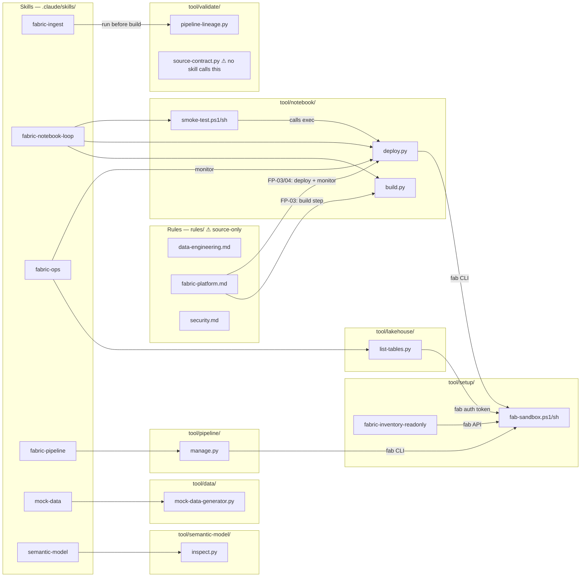

# Tooling Map

Shows which **skills** call which **tools**, which **rules** mandate specific tools, and which **tools** depend on other tools.

> **Scope**: source-package relationships. `rules/` lives in the source repo only and is not installed to target repos — rule codes (SEC-*, FP-*, DE-*) are embedded inline in skill and agent guidance instead.



## Skills with no direct tool calls

These skills guide notebook code generation but do not invoke `tool/` scripts directly:

| Skill | Why no tool call |
|---|---|
| `fabric-transform` | Silver/Gold Spark code is written into notebooks; build/deploy handled by `fabric-notebook-loop` |
| `fabric-model` | Gold DAX/dimensional patterns written into notebooks |
| `fabric-validate` | GX code written into dq_*.py notebooks; run via the notebook loop |
| `prd` | Document generation only |
| `grill-me` | Q&A interrogation only |
| `git-commit` | Uses `git` CLI, not `tool/` scripts |
| `caveman` | Response-compression mode only |

## Tool → Tool dependency chain (notebook workflow)

```
author .py  →  build.py  →  deploy.py  →  smoke-test  →  deploy.py (exec+monitor)
                                 ↓
                           fab-sandbox  ←  also called by manage.py, list-tables.py, fabric-inventory-readonly
```
