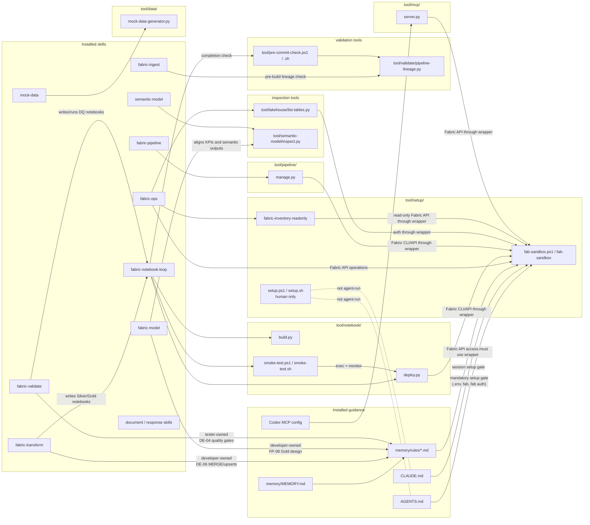

# Tooling Map

This map shows the current source-package relationships between profile guidance, installed skills, installed rules, and target-repo tools.

> Scope: source package and installed target layout. The installer copies `profiles/skills/` to `.agents/skills/` for Codex and `.claude/skills/` for Claude, copies `rules/` into target repos as `memory/rules/`, and copies `profiles/shared/project-layout/tool/` as `tool/`.



## Human-Only Boundary

| Tool | Boundary |
|---|---|
| `tool/setup/setup.ps1` / `tool/setup/setup.sh` | Human-triggered bootstrap only. Agents verify setup state and report blockers; they do not re-run setup or attempt setup repair. |

## Wrapper Boundary

All Fabric CLI/API access in installed guidance must route through `tool/setup/fab-sandbox.ps1` on Windows or `bash tool/setup/fab-sandbox` on Linux/Mac. Guidance should not show raw `fab auth`, `fab api`, or PATH-based Fabric CLI discovery.

## Skill-to-Tool Summary

| Skill or guidance | Tool relationship |
|---|---|
| `fabric-ingest` | Runs `tool/validate/pipeline-lineage.py` before notebook build. |
| `fabric-transform` | Wired to the developer agent and DE-06 for Silver/Gold Spark transformations and MERGE patterns; build/deploy still runs through `fabric-notebook-loop`. |
| `fabric-model` | Wired to the developer agent and FP-08 for Gold facts, dimensions, KPIs, and semantic-model-aligned outputs. |
| `fabric-validate` | Wired to the tester agent and DE-04 for independent DQ notebook authoring and validation. |
| `fabric-notebook-loop` | Uses notebook build, deploy, smoke-test, fetch/monitor flows, then `tool/pre-commit-check`. |
| `fabric-ops` | Uses read-only inventory, lakehouse listing, and fab-sandbox for safe Fabric operations. |
| `fabric-pipeline` | Uses `tool/pipeline/manage.py`; that helper uses fab-sandbox for Fabric access. |
| `mock-data` | Uses `tool/data/mock-data-generator.py`. |
| `semantic-model` | Uses `tool/semantic-model/inspect.py`. |
| Codex MCP config | Points to `tool/mcp/server.py`; the server uses the same wrapper boundary. |
| Developer agent guidance | Runs `tool/pre-commit-check.ps1` or `tool/pre-commit-check.sh` before reporting complete. |

## Non-Fabric Tool Skills

These skills do not invoke repository `tool/` scripts and are not Fabric notebook authoring or validation workflows:

| Skill | Reason |
|---|---|
| `prd` | Requirements document generation only. |
| `grill-me` | Plan interrogation only. |
| `git-commit` | Uses `git`, not repository `tool/` scripts. |
| `caveman` | Response-format mode only. |

## Notebook Workflow Chain

```text
author notebook .py
  -> tool/notebook/build.py
  -> tool/notebook/deploy.py
  -> tool/notebook/smoke-test.ps1 or smoke-test.sh
  -> tool/notebook/deploy.py exec/monitor
  -> tool/pre-commit-check.ps1 or pre-commit-check.sh

Fabric calls inside the chain go through tool/setup/fab-sandbox.
```
