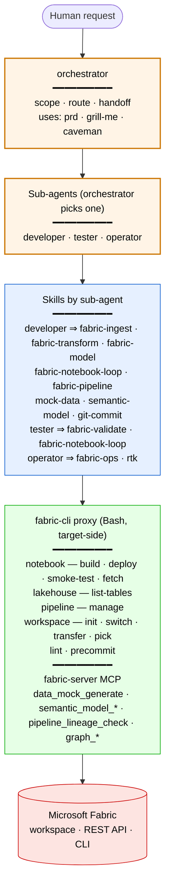

# Workflow — agents, skills, and tools

What you get in the **target repo** after `fabric-agents install` runs. Reads top-down: a request reaches an agent, the agent picks a skill, the skill drives one or more local tools, the tools talk to Microsoft Fabric.

## What the colours mean

| Colour | Layer | Where it lives in the target |
|---|---|---|
| 🟠 Orange | Agents (4) | `.claude/agents/*.md` and `.codex/agents/*.toml` |
| 🔵 Blue | Skills (14) | served from the `fabric-server` graph via `graph_get_node('skills/<name>')` |
| 🟢 Green | Tools | `fabric-cli` subcommands (Bash, target-side `tool/`) + `fabric-server` MCP tools |
| 🔴 Red | External | Microsoft Fabric workspace (CLI + REST API) |

## What each command does

`fabric-cli` (Bash, runs the target-side `tool/` scripts):

| Command | Used by |
|---|---|
| `fabric-cli notebook {build,deploy,smoke-test}` | Most data-engineering skills |
| `fabric-cli lakehouse list-tables` | `fabric-transform`, `fabric-validate` |
| `fabric-cli pipeline manage` | `fabric-pipeline` |
| `fabric-cli workspace {init,switch,transfer,pick}` | `fabric-ops`, all agents at session start |
| `fabric-cli lint` / `fabric-cli precommit` | pre-completion validation |

`fabric-server` MCP (no `ms-fabric-cli` needed):

| Tool | Used by |
|---|---|
| `data_mock_generate` | `mock-data`, `fabric-ingest` (when no real source) |
| `semantic_model_list` / `semantic_model_show` | `semantic-model`, `fabric-model` |
| `pipeline_lineage_check` | `fabric-validate`, pre-commit check |
| `graph_*` | all agents (knowledge graph read/write) |

`tool/setup/setup.{ps1,sh}` is human-run at install time; agents do not invoke it. The knowledge graph + MCP tools are served by the `fabric-server` Docker container — see [knowledge-graph.md](knowledge-graph.md).
