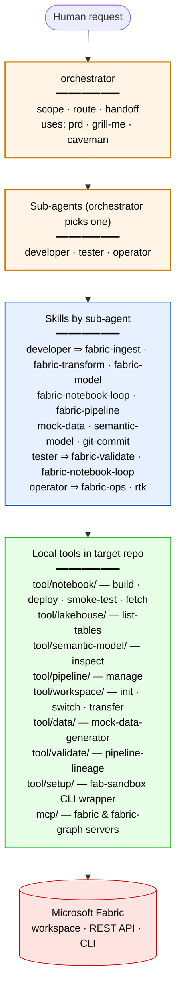

# Workflow — agents, skills, and tools

What you get in the **target repo** after `setup.ps1` (or `install-fabric-agent`) runs. Reads top-down: a request reaches an agent, the agent picks a skill, the skill drives one or more local tools, the tools talk to Microsoft Fabric.

## What the colours mean

| Colour | Layer | Where it lives in the target |
|---|---|---|
| 🟠 Orange | Agents (4) | `.claude/agents/*.md` and `.codex/agents/*.toml` |
| 🔵 Blue | Skills (14) | `.claude/skills/<name>/SKILL.md`, `.agents/skills/<name>/SKILL.md` |
| 🟢 Green | Tools (8 dirs) | `tool/<area>/*.py` and `*.sh`/`*.ps1` |
| 🔴 Red | External | Microsoft Fabric workspace (CLI + REST API) |

## What each tool does

| Tool dir | Scripts | Used by |
|---|---|---|
| `tool/notebook/` | `build.py`, `deploy.py`, `smoke-test.{ps1,sh}` | Most data-engineering skills |
| `tool/data/` | `mock-data-generator.py` | `mock-data`, `fabric-ingest` (when no real source) |
| `tool/lakehouse/` | `list-tables.py` | `fabric-transform`, `fabric-validate` |
| `tool/semantic-model/` | `inspect.py` | `semantic-model`, `fabric-model` |
| `tool/pipeline/` | `manage.py` | `fabric-pipeline` |
| `tool/workspace/` | `init.py`, `switch.py`, `transfer.py` | `fabric-ops`, all agents at session start |
| `tool/validate/` | `pipeline-lineage.py` | `fabric-validate`, pre-commit check |
| `tool/setup/` | `fab-sandbox{,.ps1}`, `fabric-inventory-readonly{,.ps1}`, `setup.{ps1,sh}` | Humans once at install; agents call `fab-sandbox` for every Fabric CLI access |

`tool/setup/setup.{ps1,sh}` and `tool/pre-commit-check.{ps1,sh}` are human-run; agents do not invoke them. `tool/graph/` and `mcp/` are infrastructure for the knowledge-graph layer — see [knowledge-graph.md](knowledge-graph.md).
